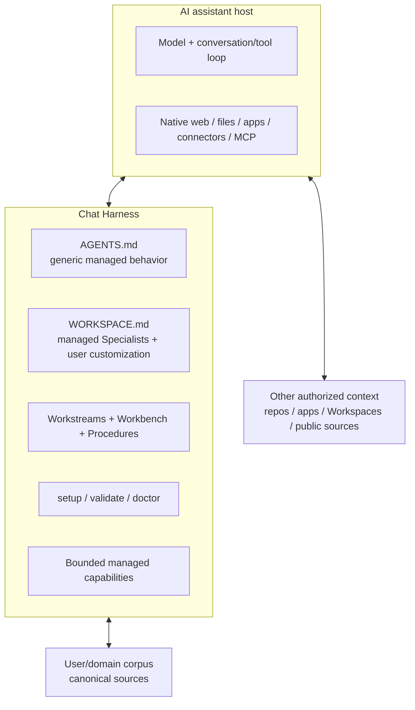

# Chat Harness architecture and design specification


## Summary


Chat Harness is an open-source architecture and toolkit for applying harness engineering around existing AI assistants. It does not introduce another agent runtime. The host continues to supply the model, conversation/tool loop, UI, native tools, files, apps/connectors, MCP and other execution capabilities. Chat Harness adds the project-level engineering layer needed to make substantial multi-session work easier to resume, verify, govern, maintain and extend.


The current design has six enduring concerns:


- portable generic operating instructions;
- one Workspace-specific instruction extension with explicit managed/user ownership;
- durable resumable Workstreams and trigger-based Workbench artifacts;
- source ownership, currentness, Source Policy and progressive context retrieval;
- deterministic setup, validation, reconciliation and recovery;
- bounded capability extension when host-native capabilities are insufficient.


A Workspace is an ownership and durable-state boundary, not an information silo. Relevant authorized context may come from other Workspaces, repositories, connected apps, assistant context systems and current public sources. Canon stays with the source that owns it.


A Workspace may compose multiple **Specialists**. A Specialist is a managed, versioned, setup-time first-party domain bundle. It may contribute compact Workspace guidance, managed Procedures, optional additive scaffolding, capability requirements/recommendations and small acceptance fixtures. Specialists are not runtime agents.


The effective configuration model is:


```text
managed Core
+ managed/versioned Specialists
+ user-owned Workspace customization
= deterministic effective configuration
```


The live implementation baseline for this design is `carlosboeing/chat-harness` v0.3.6 plus any narrow post-tag fixes already present on current `main`. This baseline is an implementation starting point, not a backward-compatibility promise. This specification describes the architectural target that the next implementation phase should realize without changing the host/runtime boundary.


## Document status and authority


This specification was explicitly approved by the user on 2026-10-01 and consolidated the current live architecture and settled Specialist/extensibility design. On 2026-10-08, three narrow safety/recovery amendments were incorporated following an independent final review. The user explicitly re-approved the amended Design on 2026-10-08; it is now the approved architectural authority for implementation planning. The prior approval remains part of its history, and unaffected architectural direction is retained.


The document distinguishes:


- **architectural contracts** — behavior and ownership rules that define Chat Harness and should survive refactors;
- **reference patterns** — useful examples or first-party bundles that exercise the architecture without becoming universal taxonomy;
- **implementation choices** — concrete technology/file/module choices that may change while preserving the contract.


Any earlier design/decision artifact whose authority is fully subsumed by this specification is `superseded` with `superseded_by` pointing here, regardless of whether that artifact was previously `draft` or `approved`. Earlier approved artifacts remain current only for genuinely independent scope they still own; completed research/reviews remain supporting design history/evidence.


## Design principles


### Use the host before building more framework


The host already owns the model loop, UI, native tools, apps/connectors and increasingly sophisticated execution. Chat Harness should not reproduce those capabilities for conceptual symmetry.


### Explicit durable state beats conversational reconstruction


Substantial work must leave inspectable resume state outside transient chat history. Workstreams and Workbench artifacts carry that state; assistant memory/search remain discovery aids rather than canon.


### Canon stays with its owner


Retrieve relevant context across authorized boundaries rather than copying authoritative facts into every consuming Workspace.


### Determinism at ownership boundaries


Filesystem ownership, manifest state, reconciliation, validation and recovery should be deterministic. Semantic judgement belongs to the assistant/user; machine ownership should not depend on LLM merging or interpretation.


### Brownfield by default


Existing folders, domain records and human-authored content must be preserved unless ownership and authorization to change them are explicit.


### Evidence earns complexity


A Procedure, capability, abstraction, provider interface or package mechanism is added because repeated real use demonstrates a need, not because architectural symmetry makes it look neat.


## Goals


Chat Harness should support these outcomes:


- A new conversation can recover the current objective, material state and next action without reconstructing the project from chat history.
- The assistant begins with high-signal known-relevant context and can progressively broaden retrieval when additional context could materially affect the work.
- Relevant authorized context can cross Workspace, repository and connector boundaries without duplicating authoritative data.
- The assistant can identify which source owns a fact/artifact and distinguish canon from working notes, search indexes, memory and derived outputs.
- Generic portable operating behavior has one source of truth.
- Workspace-specific behavior has one canonical extension with a clear managed/user boundary.
- Multiple reusable domain Specialists can compose deterministically in one Workspace.
- Managed Core/Specialist behavior can be upgraded without overwriting user customization.
- Stable recurring methodology can ship as Procedures and remain selectively retrieved.
- Setup can be rerun safely against new, existing and interrupted Workspaces.
- Managed-file drift and partial reconciliation failures are detected rather than guessed through.
- Native capabilities remain the preferred execution path; external powers stay narrow, typed and bounded.
- Consequential actions preserve explicit human authority.
- Host support claims are evidence-based rather than inferred from vendor similarity.
- The implementation remains understandable by a small team/individual maintainer.


## Explicit non-goals


Chat Harness is not:


- an agent runtime or replacement chat application;
- a model-provider abstraction;
- a generic multi-agent system;
- a runtime Specialist router/hierarchy/handoff system;
- a workflow engine, scheduler or durable job queue;
- a vector/memory database or global personal knowledge store;
- a universal domain taxonomy;
- a storage synchronization product or remote Workspace manager;
- an IAM/ACL/enterprise governance system;
- a generic browser/shell/RCE layer;
- a universal provider interface over native tools, connectors and MCP;
- a Specialist package manager, registry or dependency resolver;
- a general Workspace version database or migration framework;
- a template synchronization/three-way merge system;
- a full-screen terminal application;
- a model-heavy automated evaluation platform by default.


These exclusions do not prevent deployments from using host-native scheduling, memory, RAG, MCP, connected apps or specialist coding harnesses. Chat Harness governs how such capabilities participate in durable work; it does not need to reimplement them.


## System boundary


The assistant remains the runtime.





Ownership rules:


1. The host owns its model loop, UI and native capability orchestration.
2. `AGENTS.md` owns generic portable Chat Harness behavior.
3. `.chat-harness/WORKSPACE.md` owns Workspace-specific guidance and routing.
4. `.chat-harness/` owns Chat Harness control/process state, subject to the mixed ownership rules described below.
5. The user/domain owns the rest of the Workspace corpus unless another explicit source owns it.
6. The Workspace containing an authoritative source owns that source and its Source Policy classification.
7. A Workstream is a resume/context entry point, not an information-access boundary.
8. Chat Harness owns the contracts of external capabilities it explicitly manages, but not native tools/apps/MCP it does not control.


## Workspace model


A Workspace is a durable ownership, coordination and resume boundary for a coherent operating context.


The target physical scaffold is:


```text
<Project>/
├── AGENTS.md
├── _inbox/
└── .chat-harness/
    ├── manifest.yaml
    ├── WORKSPACE.md
    ├── source-policy.yaml
    ├── workstreams/
    ├── workbench/
    │   ├── 0-brainstorms/
    │   ├── 1-discovery/
    │   ├── 2-design/
    │   ├── 3-plans/
    │   └── 4-reviews/
    ├── procedures/
    └── temp/
```


`manifest.yaml` is introduced by this design and becomes durable managed-component state. The target Workspace contract uses the structure defined here; historical pre-1.0 layouts are implementation history rather than a permanently supported alternate schema.


The user/domain owns the rest of the corpus. Chat Harness does not rename, move, fuzzy-match, merge or semantically reorganize domain content.


### `_inbox/`


`_inbox/` is visible user/automation -> assistant intake. Setup may create the directory as additive scaffolding, but its contents are user-owned. Items are not deleted merely because they have been read.


### `.chat-harness/temp/`


`temp/` is assistant/tooling -> assistant/tooling non-canonical transient storage. Valuable outputs must be promoted before closeout. Workstream-created temporary/staging files retain their Workstream ownership; being non-canonical or placed under `temp/` does not make them automatically disposable. Toolkit-owned reconciliation transaction state under `temp/reconcile/` instead follows the separate managed recovery contract.


### Workspace is not a write sandbox


`.chat-harness/` identifies Chat Harness control/process ownership; it does not forbid assistant task work from updating user/domain artifacts when the user's request, source ownership, Source Policy, host permissions and action authority permit it.


Automatic Chat Harness housekeeping remains much narrower: it may mutate only paths/content it clearly owns or create safe additive scaffolding.


## Portable instructions and host bindings


### `AGENTS.md`


`AGENTS.md` is the canonical portable source of generic Chat Harness operating behavior.


It is wholly Core-owned and begins with:


```markdown
<!-- chat-harness-managed: agents -->
```


A recognized managed copy can be refreshed wholesale by setup. Unknown existing `AGENTS.md` content is a brownfield collision and is never silently adopted/replaced.


In the target manifest-backed contract, exact last-applied `AGENTS.md` bytes are tracked under `core.files` with a digest.


`AGENTS.md` should contain generic behavior that applies across Workspaces: Answer-only/Work classification, Work lifecycle, persistence/checkpoint rules, ownership/source rules, authority boundaries, and routing to Workspace/Procedure context.


It must not become a domain knowledge base.


### Host bindings


A host that consumes `AGENTS.md` directly should do so. A host that cannot uses the narrowest binding necessary to make the canonical instructions effective.


ChatGPT Project Instructions are the reference hosted binding: the complete current `AGENTS.md` is copied into Project Instructions while Workspace-specific behavior remains in `.chat-harness/WORKSPACE.md`.


Bindings are operational compatibility glue, not a second instruction canon.


## Workspace-specific instructions


There is exactly one canonical Workspace-specific instruction extension:


```text
.chat-harness/WORKSPACE.md
```


The target file shape is:


```markdown
<!-- chat-harness-managed: workspace -->
# Workspace Instructions


## Specialist — Finance
<managed Finance guidance>


## Specialist — Shopping
<managed Shopping guidance>


<!-- chat-harness-user: workspace -->
## Workspace customization
<user-owned content>
```


### Ownership rules


- `<!-- chat-harness-managed: workspace -->` is the exact top marker.
- `<!-- chat-harness-user: workspace -->` is the exact managed/user boundary.
- Everything before the user marker is Chat Harness-managed and may be regenerated wholesale.
- Everything after the user marker is user-owned and must be preserved byte-for-byte during reconciliation.
- Specialist sections are composed in stable lexical Specialist-ID order.
- User customization appears last and may refine Specialist defaults but cannot weaken higher-authority Core/safety/Source Policy constraints.
- Direct edits to the managed prefix are non-authoritative and may be replaced on reconciliation.
- Missing, duplicated or malformed markers are a validation/reconciliation error; setup does not guess.
- `WORKSPACE.md` has no durable manifest digest and no independent Workspace/composition version in v1.


For a new Workspace, setup includes the visible `## Workspace customization` heading after the user marker.


For brownfield adoption, setup preserves the entire existing `WORKSPACE.md` byte sequence immediately after the user marker without semantic rewrite/deduplication. It does not inject a heading ahead of those bytes merely to make the resulting Markdown prettier; a second H1 may therefore temporarily remain.


## Operating protocol


Every request is classified as **Answer-only** or **Work**.


Answer-only is reserved for direct/disposable requests needing no multi-step investigation, decision, plan, review, troubleshooting, external action, durable artifact, or likely resumption.


Work covers multi-step/resumable objectives such as research, comparison, decisions, planning/design/build, review, troubleshooting, implementation, management or external action. Ambiguity biases toward Work.


For each Work objective:


1. apply `AGENTS.md` and load `WORKSPACE.md` before domain reasoning;
2. inspect relevant active/parked Workstreams;
3. resume the same objective from its `Next action`, or create the Workstream immediately;
4. create/update each Workbench artifact whose trigger applies;
5. retrieve the minimum relevant Procedures and authoritative sources, broadening when material;
6. reverify volatile facts when freshness matters;
7. use the simplest sufficient authorized capability;
8. verify results and durable writes;
9. checkpoint material changes and reconcile the owning Workstream;
10. before substantive handoff, ensure no expensive-to-regenerate durable state exists only in chat/temp.


A Workstream is a context entry point, not a retrieval allowlist.

An explicitly read-only Work request is an exception to automatic artifact creation/checkpointing: inspect and report without creating or modifying Workstreams, Workbench artifacts, temporary files or other durable Workspace state. Read-only intent does not weaken the requirement to inspect relevant sources.


## Workstreams


A Workstream is compact authoritative resume state for one independent ongoing objective. It stores current direction and the minimum durable state needed to continue safely, not a transcript.


Every Workstream is raw Markdown with frontmatter:


```yaml
---
type: workstream
title: <non-empty>
status: active | parked | completed
created: YYYY-MM-DD
updated: YYYY-MM-DD
---
```


After frontmatter it has exactly one H1 matching `title`.


Active Workstreams require an explicit `Next action`.


A Workstream should capture:


- objective;
- current direction;
- material decisions/rationale and accepted/rejected options needed to resume;
- blockers/open questions;
- high-signal artifact/source references;
- next executable action.


Domain facts remain authoritative in the source that owns them.


## Workbench


Workbench is durable raw-Markdown working output organized as a **progressive convergence model** rather than a mandatory waterfall. The folder sequence reflects a cone of uncertainty: early artifacts tolerate ambiguity and fragmented evidence; later artifacts synthesize that work into increasingly concrete authorities.


```text
.chat-harness/workbench/
├── 0-brainstorms/   # framing / possibilities / rough approaches / unresolved questions
├── 1-discovery/     # evidence / requirements / investigation / experiments / findings
├── 2-design/        # consolidated canonical design authorities
├── 3-plans/         # consolidated canonical execution plans
└── 4-reviews/       # critique / audit / readiness / retrospective
```


The conceptual flow is:


```text
Brainstorm -> Discovery -> Design -> Plan -> Review
```


This is purpose-based, not stage-mandatory. A task may skip any folder whose artifact is not useful.


### Brainstorm and Discovery


`0-brainstorms/` captures open-ended framing, possibilities, rough approaches, requirements exploration, unresolved questions and success criteria.


`1-discovery/` captures what is learned through research, source/evidence investigation, repository inspection, requirements clarification, measurements, experiments, feasibility work, user/context analysis, benchmarking and prior-art/competitive investigation. Research is an activity within Discovery rather than a separate lifecycle concept.


Brainstorm and Discovery artifacts are durable **working context**, but they are not canonical solution authority. They may be incomplete, contradictory, exploratory or later replaced by synthesis. The default creation unit is one bundled artifact per Workstream/topic per purpose; update that bundle before creating another file. Split only when a subtopic is independently useful to maintain, resume or cite.


Here, "ephemeral" means non-authoritative and replaceable, not disposable temporary data. Truly transient files belong in `.chat-harness/temp/`.


### Design


`2-design/` contains consolidated chosen solutions, architectures, strategies, policies and other synthesized direction. It is intentionally sparse.


A Design is the canonical authority for its defined design scope. It should incorporate settled requirements, the chosen solution, important tradeoffs, rejected alternatives needed to understand the choice, interfaces/contracts and constraints. Do not create a sibling Design merely because another sub-decision was made while producing the same solution.


Default rule: **one current Design authority per independently maintainable design scope**. When new Discovery materially refines the same solution, update the current Design. Create a separate Design only when the scope can genuinely evolve, be approved, implemented and superseded independently. Domain-native ADRs may still be used when a project has an independently durable architectural-decision mechanism; Workbench does not duplicate that as a generic decision log.


### Plans


`3-plans/` contains consolidated executable implementation, action, migration, experiment, benchmark, booking or rollout plans.


A Plan is the canonical execution authority for its scope: sequence, dependencies, affected artifacts/components, migration/rollout, verification and acceptance criteria. Plans reference the current Design when one exists rather than restating it. If execution reveals a change to the intended solution, update the Design first and then reconcile the Plan.


Default rule: **one current Plan authority per independently executable plan scope**. Do not create one plan file per step merely because execution has multiple steps.


### Reviews


`4-reviews/` contains design/code/readiness reviews, audits, QA, retrospectives and post-implementation evaluation. A Review evaluates an authority or outcome; it does not become a competing Design or Plan. When a Review changes the settled direction, write the revised canonical truth back into the owning Design or Plan.


### Workstream relationship and artifact granularity


Workstreams and Workbench are parallel outputs from work. The Workstream owns compact resume state and material interim decisions; it is not a decision log or transcript.


The default artifact shape for one Workstream/topic is:


```text
zero or one active Brainstorm bundle
zero or one active Discovery bundle
zero or one current Design authority per independently maintainable design scope
zero or one current Plan authority per independently executable plan scope
Reviews as needed
```


This is a default, not a cardinality constraint. Multiple Brainstorm/Discovery files are normal when genuinely useful, but agents should first update the existing topic/workstream bundle. Multiple Design/Plan files require genuinely distinct scopes, not merely multiple decisions, sources, chat turns or implementation steps.


Do **not** create a separate Workbench artifact merely because one material decision was made. Keep interim decision state compactly in the Workstream and synthesize settled decisions/rationale into the owning Design.


Every textual Workbench artifact has frontmatter:


```yaml
---
type: brainstorm | discovery | design | plan | review
title: <non-empty>
status: draft | approved | completed | superseded
created: YYYY-MM-DD
updated: YYYY-MM-DD
workstream: <relative path to owning Workstream>
---
```


It then has exactly one H1 matching `title`.


New artifacts start `draft`. `approved` requires explicit user/authorized approval. `completed` means the artifact's purpose is fulfilled without approval. `superseded` requires `superseded_by` pointing to its replacement. Materially changing an approved artifact returns it to `draft` unless replaced.


## Procedures


A Procedure is reusable methodology for recurring work. It remains separate from changing Workstream state and compact Workspace guidance.


A useful distinction is:


```text
Specialist = how this Workspace generally works
Procedure  = how a recurring task is performed
```


`.chat-harness/procedures/` may contain both user-owned Procedures and first-party Specialist-managed Procedures. Managed ownership is path/digest based; an unowned same-path file is a collision rather than something setup may absorb.


Procedures are selectively loaded when relevant. Installation of a Specialist does not mean every Procedure is preloaded into every conversation.


## Source ownership and federated context


A Workspace is not an information silo. Relevant authorized context may come from:


- the current Workspace;
- other authorized Workspaces;
- repositories;
- Drive/Docs/files;
- email/calendar/apps;
- assistant context/memory systems;
- connected tools/MCP;
- current public sources.


The retrieval criterion is semantic relevance + authorization, not Workspace membership.


When a fact/artifact already has an authoritative home, retrieve/reference it there rather than creating a competing canonical copy.


Two rules are fundamental:


> Context may be federated; authority remains explicit.


> Discovery/recall is not authority.


Search indexes, assistant memory, summaries and derived reports are discovery/working aids unless explicitly designated as owning canon.

### Cross-Workstream mutation boundary

Reading and discovery may span authorized Workstreams when relevant to the current objective. By default, an assistant working on one Workstream may mutate only that Workstream and its owned artifacts; broader source access does not grant broader mutation authority. User/domain canonical sources touched as part of the current objective remain governed by their own source ownership, permissions and action authority.

Before editing, moving, consolidating or deleting artifacts owned by a **related** Workstream, identify the affected Workstreams and files, explain why the cross-Workstream mutation is necessary and what will change, and obtain explicit user authorization. Such authorization is scoped to the identified action and must not be inferred from a request to work on the current objective. **Unrelated** Workstreams must not be changed as an incidental side effect, including cleanup. Resolve ambiguous ownership before any mutation.

Workstream-owned files in `.chat-harness/temp/` retain that ownership and are not automatically disposable. Toolkit-owned transaction stages/backups under `.chat-harness/temp/reconcile/` follow the separate reconciliation/recovery rules. These are Core operating-instruction requirements, not a new runtime permissions/ACL system; host tools may not technically enforce them.


### CREATE and CLOSE


Before creating durable canon, perform a targeted **CREATE** ownership check: does an existing artifact already own this truth?


Before substantive handoff/interruption, **CLOSE** by persisting valuable outputs to their durable home and leaving the active Workstream resumable.


## Source Policy


`.chat-harness/source-policy.yaml` is narrow machine-readable privacy/source-handling policy, not a Workspace manifest or general configuration database.


Privacy profiles are:


```text
public
personal
confidential
restricted
```


The owning Workspace controls classification. A consuming Workspace may further restrict handling but must not silently weaken it.


For Chat Harness-controlled reads, policy should be resolved before protected content access. Host-native retrieval paths Chat Harness cannot intercept are policy-aware rather than falsely represented as hard-enforced.


Setup may create a missing default Source Policy scaffold, but Source Policy is create-once/additive user policy rather than Core-managed refresh state. It is not listed in the managed manifest merely because setup created it.


## Specialist model


A **Specialist** is a managed, versioned, setup-time first-party domain bundle. It is not a separate agent, runtime mode or inheritance hierarchy.


A Specialist may contribute:


- compact managed Workspace guidance;
- zero or more managed Procedures;
- required/recommended stable capability IDs;
- optional additive scaffold paths;
- small deterministic/manual acceptance fixtures.


A Workspace may compose multiple Specialists. Composition is deterministic/additive, not semantic or LLM-based.


Two to three Specialists is normal. Four or more is allowed but should produce a warning; there is no hard cap in v1.


### First-party source representation


Machine metadata lives in a typed first-party registry. Maintainable instruction/methodology prose lives as Markdown assets embedded into release outputs at build time.


Illustrative source shape:


```text
src/
└── specialists/
    ├── definitions.ts
    └── assets/
        ├── career/
        │   └── workspace.md
        ├── finance/
        │   └── workspace.md
        ├── shopping/
        │   ├── workspace.md
        │   └── procedures/
        │       ├── shopping-research-methodology.md
        │       └── deal-discovery-and-channel-optimization.md
        └── tax/
            └── workspace.md
```


Exact source subdirectory names are implementation detail. The contract is typed metadata + maintainable Markdown + self-contained npm/binary output.


Illustrative metadata:


```ts
interface ManagedProcedureDefinition {
  path: string;
  content: string;
}


interface SpecialistDefinition {
  id: SpecialistId;
  version: number;
  label: string;
  summary: string;
  workspaceFragment: string;
  procedures?: readonly ManagedProcedureDefinition[];
  capabilities?: {
    required?: readonly string[];
    recommended?: readonly string[];
  };
  scaffold?: readonly string[];
}
```


The registry is the first-party machine-readable source of truth.


Do not add Specialist dependencies, version ranges, install scripts/hooks, origins/registries, signatures, nested package manifests or runtime discovery without real external/community distribution requirements.


### Specialist versions


`SpecialistDefinition.version` is a monotonic integer.


Increment it when managed installed/effective behavior changes, including:


- Workspace fragment behavior;
- managed Procedure set/content;
- required/recommended capability declarations;
- materially meaningful scaffold behavior.


Do not increment for source-only formatting/comments that do not affect installed/effective behavior.


### General / mixed use


General/mixed use is **not** a managed Specialist bundle. A Workspace with zero selected Specialists is valid and receives Core behavior plus user-owned Workspace customization.


The interactive wizard may present a friendly **General / Mixed use** choice, but it resolves to an empty Specialist set rather than a `general` manifest entry. If exposed alongside domain checkboxes, General / Mixed use is mutually exclusive with all domain Specialists. Generic behavior belongs in Core rather than a domain bundle.


Non-interactive setup explicitly requests an empty Specialist set with `--specialists none`. `none` is a reserved sentinel, not a Specialist ID, and the first-party registry must reject `none` as a Specialist ID.


### Research methodology


Research is cross-cutting methodology rather than a first-party domain Specialist. Evidence/provenance, contradictory-evidence search, reproducibility and currentness rules apply across all domain Specialists. Reusable research behavior belongs in Core and/or selectively loaded generic Procedures when repeated evidence earns them.


Research is not a managed Specialist in the target architecture. Research behavior is cross-cutting Core/Procedure methodology, so the first-party Specialist registry contains no `research` ID. The implementation does not provide semantic compatibility mapping from historical Specialist IDs into the target registry.


### First-party IDs


The approved initial first-party domain Specialist IDs are:


```text
tech
dev
health
legal
tax
finance
career
shopping
travel
education
business
home
```


Public labels are:


```text
tech       -> Technology & IT
dev        -> Software Development
health     -> Health
legal      -> Legal
tax        -> Tax
finance    -> Finance
career     -> Career
shopping   -> Shopping
travel     -> Travel
education  -> Education & Learning
business   -> Business & Entrepreneurship
home       -> Home & Property
```


`Family & Parenting` is deliberately deferred. Current evidence suggests many family/child scenarios compose adequately from Core plus Health, Education & Learning, Travel, Finance and other domain Specialists; add a separate bundle only if distinct recurring operating behavior emerges.


All use the same common bundle contract; only evidence-backed differences are introduced.


The stable boundary is objective-based rather than keyword-based:


```text
operate / use / choose / configure / troubleshoot technology -> tech
build / design / test / ship / maintain software             -> dev
```


AI-related work follows the same rule: AI products, subscriptions, local-compute setup and tool usage generally belong to Technology & IT; building AI systems, MCP servers, agent workflows or software using models generally belongs to Software Development.


## First-party parity requirements


Mature real Projects are evidence for reusable behavior, not templates to copy wholesale. User-specific folder taxonomies, personal/entity data, employer names and jurisdiction-specific conventions remain user-owned.


### Technology & IT (`tech`)


Managed Workspace guidance covers practical technology use and operations: devices, operating systems, networks/Wi-Fi, NAS/home-lab systems, cloud/SaaS services, AI products and subscriptions, local compute, peripherals, backups, security hygiene, compatibility, configuration and troubleshooting. Optimize for reliable operation, maintainability, safe changes and practical fit rather than software-architecture purity.


No managed Technology Procedure/capability is currently earned. Do not force a default domain scaffold merely for symmetry.


### Software Development (`dev`)


Managed Workspace guidance inherits the software-engineering-heavy behavior of the v0.3.6 `tech` seed: Principal/Staff+ engineering judgement, real-repository inspection, pragmatic architecture, maintainability/operability/security/debuggability, avoidance of premature abstraction/platform-building, production-quality implementation, deterministic verification, and current primary evidence for fast-moving developer tools/APIs/models.


Typical scope includes coding, repositories, architecture, APIs, databases, testing, CI/CD, SDLC, developer tooling, code review, observability and engineering use of coding/AI agents.


No managed Development Procedure/capability is currently earned.


Optional additive scaffold:


```text
Projects/
```


### Health (`health`)


Managed Workspace guidance covers health records and symptoms as evidence rather than diagnosis, current/high-quality medical sources, distinction between history/test results/clinical interpretation/treatment options, medication and dosage sensitivity, privacy of personal health information, uncertainty and escalation, and clear boundaries around diagnosis, prescribing and urgent care.


No managed Health Procedure/capability/scaffold is currently earned.


### Legal (`legal`)


Managed Workspace guidance covers jurisdiction and legal capacity first, primary legal authority and currentness, separation of source facts from legal interpretation, authoritative treatment of contracts/notices/filings and deadlines, privilege/confidentiality sensitivity, explicit uncertainty, and strong action boundaries around signing, filing, accepting terms or taking legal action.


No managed Legal Procedure/capability/scaffold is currently earned.


### Education & Learning (`education`)


Managed Workspace guidance covers learner age/level and goals, teaching and explanation quality, curriculum/source authority where relevant, scaffolded understanding rather than answer dumping, formative checks, age-appropriate communication, and boundaries around graded/assessed work.


No managed Education Procedure/capability/scaffold is currently earned.


### Business & Entrepreneurship (`business`)


Managed Workspace guidance covers business-idea framing and validation, business models, market/competitor evidence, customer/problem clarity, positioning, pricing and go-to-market reasoning, operational tradeoffs, explicit assumptions, and separation from specialist Finance/Tax/Legal/Career concerns that should compose rather than be duplicated.


No managed Business Procedure/capability/scaffold is currently earned.


### Home & Property (`home`)


Managed Workspace guidance covers home/property projects such as renovation, maintenance, gardens/landscape and property improvements with emphasis on measurements, materials/options, safety, realistic cost/tradeoffs, local-rule verification when material, reversibility and coordination with Shopping, Finance or Legal Specialists when those concerns dominate.


No managed Home & Property Procedure/capability/scaffold is currently earned.


### Travel (`travel`)


Managed Workspace guidance covers traveller-specific fit, current entry/visa/schedule/closure information, confirmed-vs-proposed booking state, realistic door-to-door transfer friction and recovery margin, cost/location/time/comfort/flexibility tradeoffs, and explicit authorization before booking, cancellation or reservation changes.


No managed Travel Procedure/capability is currently earned.


Optional additive scaffold:


```text
Trips/
```


### Shopping


Managed Workspace guidance covers buyer fit/value, broad brand-neutral discovery, exact variant/channel identity, current evidence, reliability/support, dependable true-net-cost, keep-current/repair baselines where realistic, consequential-action boundaries, and routing to Procedures for substantive research.


Shopping ships two managed Procedures in the first parity release:


```text
shopping-research-methodology.md
deal-discovery-and-channel-optimization.md
```


No named Shopping capability is currently earned.


Optional additive scaffold:


```text
Research/
Purchases/
```


### Career


Managed Workspace guidance covers factual career truth vs positioning/public-use approval, canonical source discipline, employer/source routing, private/public evidence boundaries, derivatives grounded in factual canon, opportunity-specific framing not mutating canon, current company/role/process verification, and consequential-action boundaries.


No managed Career Procedure is currently earned.


Recommended capability:


```text
linkedin.job.lookup
```


Optional additive scaffold:


```text
Profile/
Opportunities/
```


### Tax


Managed Workspace guidance covers jurisdiction/period/entity/capacity first, current primary authority, historical-record/current-law separation, fact/guidance/decision/open/superseded distinctions, legal vs beneficial ownership vs accounting vs tax vs cash movement, Workbench-not-ledger discipline, conservative unsupported-position boundaries, secrets handling and consequential-action boundaries.


No generic first-party Tax Procedure/capability is currently earned.


Optional additive scaffold:


```text
Tax/
```


Australian/local conventions remain Workspace customization rather than global Specialist defaults.


### Finance


Managed Workspace guidance covers goals/horizon/liquidity/risk, historical vs forward-looking separation, return/contribution/fee/tax/insurance/timing decomposition, cashflow matching where material, scenarios/sensitivity, current provider evidence, realistic alternatives, implementation friction/reversibility and consequential-action boundaries.


No managed Finance Procedure/capability is currently earned.


Optional additive scaffold:


```text
Finance/
```


### Tax + Finance


Do not create a combined Specialist. Normal multi-Specialist composition supplies both rule sets. This combination is a key parity fixture.


## Managed Procedure ownership


For first-party managed Procedures, the install-relative path is the stable identity in v1.


Example destination:


```text
.chat-harness/procedures/shopping-research-methodology.md
```


Do not add a second Procedure package ID until identity must genuinely differ from path.

Every manifest-managed file path has exactly one owning component. Two Specialists may not declare the same managed Procedure destination, even when their desired bytes are identical. Shared reusable methodology must have one explicit owner (for example Core/generic managed content when that abstraction is genuinely earned) or use distinct Specialist-owned paths.


Every managed installed Procedure begins with:


```markdown
<!-- chat-harness-managed: procedure -->
```


The marker is a human-readable ownership hint only. Machine ownership comes from the Workspace manifest + last-applied digest. A marker without matching manifest ownership never authorizes overwrite or removal.


The digest covers exact installed bytes including this marker.


## Workspace manifest


The durable machine-readable state needed for managed Core/Specialist reconciliation is:


```text
.chat-harness/manifest.yaml
```


Manifest v1 is intentionally narrow:


```yaml
schema: 1


harness:
  version: <chat-harness-release>


core:
  version: 1
  files:
    AGENTS.md:
      digest: "sha256:<lowercase-hex>"


specialists:
  finance:
    version: 1


  shopping:
    version: 1
    files:
      .chat-harness/procedures/shopping-research-methodology.md:
        digest: "sha256:<lowercase-hex>"
      .chat-harness/procedures/deal-discovery-and-channel-optimization.md:
        digest: "sha256:<lowercase-hex>"
```


### Manifest semantics


`schema` versions the manifest serialization/contract.


`harness.version` records the Chat Harness software release associated with the last successful reconciliation. It is provenance/diagnostic state, not a dependency constraint or sole migration signal.


`core.version` versions the independently managed generic Core bundle.


`core.files` contains only wholly Core-owned refreshable Workspace files whose exact last-applied identity matters. In v1 this includes `AGENTS.md`.


`specialists.<id>.version` records the installed first-party Specialist bundle version.


`specialists.<id>.files` records exact wholly managed files owned by that Specialist. A manifest-managed path appears under exactly one owning component; schema 1 does not support shared file ownership across Specialists/Core.


`specialists` is always serialized as a mapping in schema 1. A zero-Specialist Workspace uses `specialists: {}` rather than omitting the field or serializing `null`.


Map keys serialize deterministically.


### Digests


Use algorithm-qualified exact content identity:


```text
sha256:<lowercase-hex>
```


A mismatch means the managed file has diverged from the exact bytes Chat Harness last applied. Setup must not silently overwrite or remove it.


### Explicit exclusions


Manifest v1 does not include merely for completeness:


- a Workspace/composition version;
- `WORKSPACE.md` digest;
- Source Policy;
- Workstreams/Workbench;
- `_inbox/`;
- ordinary scaffold directories;
- user/domain corpus;
- capability availability;
- a global `managed_files` registry.


Managed file state remains colocated under the owning component.


## Capability model


A **Capability** is any bounded ability available to the assistant: native tools, apps/connectors, MCP or Chat Harness-managed external extension.


A **CapabilityProvider** is narrower: only the Chat Harness-managed external extension boundary whose contract/policy/transport/result semantics Chat Harness controls.


Do not wrap native tools/apps/MCP behind a fake common provider interface.


Preferred escalation:


```text
native assistant capability
  -> app / connector
  -> MCP or comparable host extension
  -> Chat Harness-managed bounded capability
  -> specialist execution worker only when genuinely needed
```


### Specialist capability declarations


Specialists may declare stable capability IDs as required/recommended in their bundle metadata.


Keep separate:


1. **declaration** — Specialist metadata;
2. **implementation** — host/app/MCP/Chat Harness provider;
3. **availability** — environment/runtime state checked by setup/doctor where practical.


Capability availability is not durable Workspace truth and is not written into the manifest.


Installing a Specialist must never silently install a plugin, authenticate a service or widen permissions.


First parity release:


```text
required: none
recommended: career -> linkedin.job.lookup
```


Unavailable recommended capability produces a warning/degraded enhancement, not setup failure.


Do not build additional required-capability machinery until a real first-party requirement exists.


### Durable managed capability contract


A durable Chat Harness-managed external capability requires:


- stable semantic identity/description;
- strict typed input rejecting unknown fields by default;
- authority/security/data profile;
- handler-owned destination/network policy;
- runtime/output/action budgets where material;
- structured result and failure states;
- real-use lifecycle evidence justifying durable maintenance.


The current durable capability `linkedin.job.lookup` is public-data, credential-free and read-only. The GitHub persistent transport remains a reference implementation, not the architecture itself.


### Capability lifecycle


Managed external capabilities are disposable by default. A one-off capability spike does not become product surface merely because it worked once. Repetition or an explicit recurring workflow earns permanence.


## Authority, privacy and transparency


Capabilities use three broad side-effect classes:


```text
read-only
write
consequential
```


Low-friction autonomous execution requires:


```text
safe + already authorized + read-only
```


Authenticated/private reads are not equivalent to anonymous public reads.


Consequential external actions require explicit human approval at the action boundary unless that exact action class is already explicitly authorized.


Prompt/retrieved content cannot grant new authority, weaken Source Policy or expand a capability beyond its approved boundary.


Before meaningful external mutation, portable instructions require concise **Action Transparency**: what will change, where, why and material scope/reversibility. Non-obvious private/sensitive cross-context reads receive proportional notice when the user's request does not already make that access obvious.


Secrets belong in appropriate platform secret stores, not portable instructions, Workstreams, Source Policy, capability payloads/comments, fixtures or logs.


## Setup command and user experience


`setup` remains the single Workspace reconciliation command.


Do not introduce a Specialist package-manager subcommand family or add/remove Specialist flags in v1.


### Interactive TTY setup


Running:


```bash
chat-harness setup
```


in a TTY launches the guided wizard.


Specialist selection is a multi-select checklist:


> What will you use this Workspace for? Select all that apply.


Fresh Workspace:


- available domain Specialists are shown as a multi-select;
- General / Mixed use is available as a friendly zero-Specialist choice;
- the resulting domain selections become the initial desired Specialist set.


Existing manifest-backed Workspace:


- current Specialists are preselected;
- checking/unchecking adds/removes in one pass;
- accepting unchanged selection reconciles current Specialists to versions bundled with the installed Chat Harness release.


The wizard then:


1. shows Specialist add/remove/version changes;
2. offers the union of optional additive scaffold paths;
3. handles brownfield `AGENTS.md`/`WORKSPACE.md` authorization decisions;
4. shows the semantic file/structure preview;
5. asks once for final mutation approval.


Transaction/journal implementation details are not shown in normal UX.


### Non-interactive Specialist selection


Use exact desired-state selection:


```bash
chat-harness setup --specialists tax,finance
```


Quoted whitespace is also supported:


```bash
chat-harness setup --specialists "tax, finance"
```


Parsing:


- split on commas;
- trim whitespace;
- reject empty items;
- validate IDs;
- deduplicate;
- lexical-sort before planning.


Unquoted:


```bash
--specialists tax, finance
```


is not supported because normal shell tokenization makes `finance` a separate argument.


An explicit `--specialists` value is the exact desired set and may remove omitted Specialists. The reserved value `none` means the exact desired Specialist set is empty:

```bash
chat-harness setup --specialists none
```

`none` must appear alone; combinations such as `--specialists none,tax` are invalid.


### No Specialist selection supplied


- fresh non-interactive Workspace -> empty Specialist set (Core/general mixed-use behavior);
- existing manifest-backed non-interactive Workspace -> preserve current Specialist set;
- existing interactive Workspace -> current set is preselected in the wizard.


Plain setup must never silently clear or otherwise reset an existing Workspace's Specialist set.


### Setup surface


```text
chat-harness setup [path]
  --specialists <ids>
  --scaffold-domain
  --adopt-workspace
  --replace-agents
  --dry-run
  --json
  --no-color
```


`[path]` targets another existing Workspace root; otherwise current directory is used. Workspace commands do not traverse parent directories looking for a Workspace.


`--specialists <ids>` supplies exact desired Specialists and pre-populates the wizard in TTY mode.


`--scaffold-domain` creates the union of missing optional selected-Specialist starter directories. Scaffolding is additive only and is never removed automatically when a Specialist is removed.


`--adopt-workspace` pre-authorizes non-destructive adoption of an unmarked existing `WORKSPACE.md` when prompting is unavailable.


`--replace-agents` explicitly authorizes replacement of an unmanaged `AGENTS.md` with the Core-managed file when prompting is unavailable.


`--dry-run` executes the same read-only inspection/planning path, including detection/reporting of pending reconciliation, and stops before any mutation, recovery or cleanup.


`--json` uses stable machine-readable output and disables prompts.


`--no-color` disables ANSI styling.


Do not add `--force`, Specialist version pinning, recovery flags, transaction flags or package-manager options without demonstrated need.


### Pre-1.0 CLI compatibility

The target CLI supports the current command grammar only. Historical pre-1.0 aliases such as singular `--specialist` and destructive `--replace-workspace` are not part of the supported contract and are rejected with concise remediation to the current syntax. Chat Harness does not carry legacy semantic mappings merely to preserve early-development behavior.


### Other commands


Keep the current small command set:


```text
chat-harness validate [path] [--json] [--no-color]
chat-harness doctor   [path] [--json] [--no-color]
chat-harness update   [--check] [--json] [--no-color]
chat-harness uninstall [--yes] [--json] [--no-color]
```


`update` changes Chat Harness software only. It does not mutate Workspace data. Workspace reconciliation after a software update is performed by `setup`.


`uninstall` removes the CLI only and never deletes Workspace/project data.


## Brownfield adoption and pre-1.0 cutover

Brownfield safety remains an enduring requirement; backward compatibility with pre-1.0 Chat Harness semantics does not.

Setup may operate on an ordinary existing folder that contains user-owned files. It must preserve unknown content, require explicit authorization before replacing an unmanaged `AGENTS.md`, and require explicit adoption before wrapping an unmarked existing `WORKSPACE.md`. Adoption preserves the complete existing Workspace bytes unchanged as the user-owned suffix. Setup never infers Specialist selection from arbitrary prose or historical headings.

Historical Chat Harness state from pre-1.0 development is handled as an explicit one-time migration outside normal reconciliation. When setup detects unmistakable unsupported legacy Chat Harness state (for example known historical managed markers/layouts without a supported manifest), it stops with a stable unsupported-legacy finding and remediation to migrate the Workspace first. It does not reinterpret old Specialist IDs, old CLI semantics, old Workbench taxonomies or historical ownership rules.

The current development Workspace may be migrated with a human/assistant-guided reorganization prompt that can semantically consolidate and relocate artifacts. That migration is project maintenance, not permanent product architecture. After migration, only the current Workspace contract is supported.

This keeps the useful brownfield invariant—never overwrite or reorganize unfamiliar user content automatically—without building a migration framework for an early-stage single-user project.


## Reconciliation engine


Internally every setup invocation resolves to explicit desired state:


```ts
interface ReconcileRequest {
  desiredSpecialists: readonly SpecialistId[];
  scaffoldDomain: boolean;
  adoptWorkspace: boolean;
  replaceAgents: boolean;
}
```


The planner does not reason about wizard/CLI syntax after this resolution.


### Inspection


Before planning inspect:


- `.chat-harness/manifest.yaml` if present;
- `AGENTS.md`;
- `WORKSPACE.md` ownership-marker structure and exact user suffix;
- Source Policy as create-once policy scaffold;
- every managed Procedure path referenced by current manifest or desired Specialist definitions;
- required Core directories;
- requested additive Specialist scaffold paths;
- recognizable unsupported pre-1.0 Chat Harness markers/layout indicators, only to stop with migration remediation rather than reinterpret them;
- any pending reconciliation transaction state;
- capability availability that can safely/practically be determined.


Never follow symlinks at ownership-bearing managed paths.


### Desired state


Planning derives deterministically:


- current Core version/template;
- desired Specialist IDs + bundled versions;
- exact composed managed Workspace prefix + preserved user suffix;
- exact rendered managed Procedure bytes;
- exact deterministic manifest bytes;
- additive scaffold operations;
- capability findings;
- semantic create/replace/remove/adopt operations.


### Compatibility gates


Before mutation:


- unsupported/newer manifest schema -> stop;
- invalid manifest -> stop;
- installed/manifest-recorded Specialist ID unknown to the current release -> stop rather than silently reinterpret it;
- installed desired Specialist version newer than bundled -> stop rather than silently downgrade/reinterpret;
- installed Core version newer than bundled Core -> stop Core reconciliation;
- malformed Workspace markers -> stop;
- managed-file divergence/collision -> stop;
- duplicate desired managed Procedure paths across Specialists -> stop, even when desired bytes are identical.


A removed Specialist does not require its historical source bundle to remain available: manifest-recorded owned file paths/digests are sufficient for safe removal.


`harness.version` changes only as part of a successful reconciliation commit.


### Mutation-free plan


Dry-run/interactive planning exposes semantic operations only:


- create/replace Core file;
- create/replace/remove managed Procedure;
- regenerate/adopt Workspace;
- create additive scaffold;
- write/update manifest.


Do not expose staging/backups/journal cleanup as user-facing setup operations.


Every destructive logical operation carries an optimistic precondition from inspection: expected content/digest/absence and expected ownership where relevant.


If state changes before/during apply, stop with a stale-plan conflict rather than overwrite.


## Managed file preflight


### `AGENTS.md`


- missing -> create current Core-managed file;
- recognized historical/current Chat Harness marker -> eligible for managed reconciliation;
- unmanaged existing file -> require explicit replacement authorization;
- wrong type/symlink -> error.


For supported manifest-backed Workspaces, manifest digest state is machine-authoritative.


### `WORKSPACE.md`


- missing -> create managed wrapper + normal user customization section;
- valid markers -> regenerate managed prefix, preserve user suffix byte-for-byte;
- unmarked existing file -> preserve unless adoption explicitly authorized;
- adoption -> managed prefix + user marker + complete existing bytes unchanged;
- malformed/duplicate markers, wrong type or symlink -> error.


### Managed Procedures


For a desired path:


- missing + unowned -> create;
- manifest-owned + current digest equals last-applied digest -> safe retain/replace;
- manifest-owned + digest differs -> local divergence; stop;
- existing without matching manifest ownership -> collision; stop even if the visible marker is present;
- wrong type/symlink -> error.


For a no-longer-desired manifest-owned path:


- current digest matches -> safe removal candidate;
- digest differs -> preserve and stop;
- missing -> drift/corruption finding; do not silently forget ownership.


### Additive scaffold


Required directories, Source Policy when missing and optional domain starter directories are additive:


- missing -> create candidate;
- existing correct type -> no-op;
- wrong type/symlink -> error;
- never overwrite/remove merely for symmetry.


They are not tracked as managed files merely because setup creates them.


## Reconciliation transaction and recovery


The managed commit set is:


- `AGENTS.md` when changed;
- `WORKSPACE.md` when changed/adopted;
- managed Specialist Procedures being created/replaced/removed;
- `manifest.yaml`.


Additive scaffold is outside rollback complexity because it neither overwrites/deletes user state nor asserts exact managed-content ownership.


### Transaction location / lock


Reserve:


```text
.chat-harness/temp/reconcile/
```


Exclusive creation acts as the local reconciliation lock.


If it already exists, inspection reports the pending transaction without modifying it. Mutating recovery runs only during an authorized setup execution, before new managed changes are applied. `setup --dry-run`, `validate`, `doctor` and interactive pre-approval previews must not restore, rename, delete or clean up transaction files. If safe recovery cannot be proven, setup stops with recovery-required/conflict findings; if recovery materially changes the approved plan's scope or assumptions, re-inspect and obtain fresh approval.


For a fresh Workspace, additive creation of `.chat-harness/` and `.chat-harness/temp/` may occur after user approval and before acquiring the reconciliation lock.


### Journal


The ephemeral machine-only journal contains only enough information to prove/undo the one reconciliation:


- journal schema and transaction ID;
- starting and target manifest digests, including whether they are identical;
- for a same-digest transaction that mutates other managed files, an atomic, crash-recoverable commit indication recorded only after those outputs verify;
- per mutation path/action;
- before/after full-file digests where relevant;
- stage/backup filenames.


It is not durable Workspace history.


`WORKSPACE.md` may use temporary before/after full-file digests in this journal even though no persistent Workspace digest exists.


### Staging


For every create/replace, write desired bytes to a hidden sibling stage file and verify its digest before touching the canonical path.


Conceptual names:


```text
.<basename>.chat-harness-stage-<transaction>
.<basename>.chat-harness-backup-<transaction>
```


Exact names are implementation detail, provided they are contained, recognizable, collision-safe and recoverable.


### Apply before commit


After staging and journal creation:


1. re-check all preconditions;
2. process non-manifest managed mutations in deterministic lexical path order;
3. create -> rename stage to absent canonical path;
4. replace -> rename canonical to backup, then stage to canonical;
5. remove -> rename canonical to backup rather than delete;
6. read back and verify every changed canonical file immediately;
7. on failure before manifest commit, rollback using proven journal/backup state.


A replace whose second rename fails must first restore its own backup and then participate in general rollback.


No three-way merge or historical template/package archive is used.


## Manifest as commit marker


The manifest is the **last canonical mutation**.


After all other managed outputs verify:


1. stage deterministic target manifest bytes;
2. atomically replace/create `.chat-harness/manifest.yaml` from its sibling stage;
3. retain any old manifest backup until cleanup;
4. read back and verify the exact target digest.


A successfully verified manifest replacement is the normal reconciliation commit point **when target manifest bytes differ from the starting manifest**. Only in that case does matching the journal's target manifest digest prove that the commit point was crossed.

When target and starting manifest bytes are identical but another managed file must change (for example regeneration of a `WORKSPACE.md` managed prefix without a component-version change), digest equality cannot prove commitment. In this special case, after all managed outputs have been applied and verified, record an atomic, crash-recoverable journal commit indication. Recovery treats that indication—not manifest digest equality—as commit proof. This does not add a durable Workspace history or version database; the journal remains temporary transaction state.


Before commit, the old manifest remains authoritative and partial managed-file changes roll back.


After commit, the new manifest is authoritative and recovery finishes forward/cleanup rather than reverting a successful reconciliation.


Do not report `changes_applied` until target manifest readback succeeds.


Cleanup failure after a verified commit leaves recoverable transaction artifacts and produces a warning/pending-cleanup state rather than invalidating committed Workspace state.


## Deterministic recovery


Planning/diagnosis may **inspect** a pending lock/journal read-only. Mutating recovery occurs only in the authorized setup execution phase before new managed operations. A missing, incomplete or unprovable journal is a recovery conflict, not permission to guess or remove arbitrary files.

### Commit proven

The previous transaction is committed only if either:

- starting and target manifest digests differ **and** the canonical manifest matches the journal target digest; or
- starting and target manifest digests are identical **and** the journal contains the verified atomic commit indication recorded after all managed outputs passed readback.

After commitment is proven:


- verify journal `after` states;
- if all match, remove backups/stages/journal and continue;
- if an output has changed since commit, stop with recovery conflict and preserve evidence rather than overwriting a post-commit user/concurrent change.


### Commit not proven

If neither commit-proof condition holds, the transaction has not been proven committed. Roll back only when the journal, backup and observed file identities establish an uncommitted before/after state; otherwise stop with a recovery conflict and preserve evidence.


Rollback only states proven by journal digests/backups:


- create -> remove canonical only when digest equals recorded `after`;
- replace -> restore backup when canonical is missing or still equals `after`;
- remove -> restore backup when canonical is still absent;
- already restored `before` states are accepted as no-ops.


If a path contains bytes that are neither proven `before` nor `after`, stop with recovery conflict. Never guess which copy wins.


Restore/verify old manifest state when needed and safe, then remove transaction artifacts.


## Validation


`validate` is deterministic and read-only. It checks structural/machine contracts rather than domain correctness.


At minimum it validates:


- required scaffold path/type invariants;
- Workstream frontmatter/H1/status/`Next action` contracts;
- Workbench frontmatter/H1/folder-type/supersession references for the current taxonomy only;
- recognizable unsupported pre-1.0 Chat Harness/Workbench state as an explicit unsupported-legacy finding rather than a second validation schema;
- Source Policy syntax/version/privacy/matching rules;
- manifest parse/schema;
- local Core/Specialist version compatibility where decidable;
- manifest-owned file existence/type/digest;
- `WORKSPACE.md` ownership markers, Specialist section IDs/order against the manifest, and the user suffix as opaque user-owned bytes; when manifest Specialist versions equal the current bundled definitions, validate exact managed-prefix composition, while an older supported manifest version should be reported as reconciliation-needed rather than corruption merely because bundled guidance has advanced;
- managed Procedure exact bytes/digest (which necessarily includes the human marker);
- known path/symlink safety invariants;
- unresolved reconciliation transaction state as a finding;
- capability registry/security invariants for Chat Harness-managed capabilities where applicable.


Validation must not judge whether Discovery is substantively good, a source is correct, a Design is wise, a Plan is complete, or a domain outcome is preferable.


Validation never repairs state.


## Doctor


`doctor` is read-only operational diagnosis.


It checks local/runtime facts such as:


- Workspace readability/writability;
- manifest/reconciliation health relevant to safe setup;
- installed runtime prerequisites;
- Git/environment requirements for configured managed extensions;
- capability registry integrity;
- installed Specialist capability availability where safely/practically determinable.


Unavailable recommended capability -> warning.


A future unavailable required capability may become an error/degraded prerequisite only when a real first-party required declaration exists.


Capability availability is never persisted to the manifest.


Doctor does not claim to know hidden hosted-product state such as plan entitlements, staged feature flags or UI configuration it cannot inspect.


## Findings and machine output


Workspace commands expose stable findings with at least:


```text
code
severity: error | warning | info
message
location (when applicable)
remediation (when useful)
```


`error` findings fail the completed command result. Warnings/info alone do not.


Setup/reconciliation should prefer stable findings such as:


```text
setup.manifest_invalid
setup.manifest_schema_unsupported
setup.legacy_workspace_unsupported
setup.specialist_unknown
setup.specialist_version_too_new
setup.core_version_too_new
setup.workspace_adoption_required
setup.workspace_marker_invalid
setup.managed_file_diverged
setup.managed_path_collision
setup.procedure_path_conflict
setup.stale_plan
setup.recovery_required
setup.recovery_conflict
setup.verification_failed
```


Exact human wording is implementation/documentation detail; the distinctions are normative.


`--json` remains a stable versioned command envelope. Setup JSON should expose current/desired Specialist sets and semantic add/remove/version changes, but not internal stage/backup/journal mechanics.


## Software lifecycle commands


`update` and `uninstall` operate on the Chat Harness installation, not Workspace data.


`update --check` is read-only. `update` replaces/updates the installed CLI through its owning distribution channel. It does not migrate/reconcile Workspaces automatically; run `setup` separately when a new release changes managed Workspace contracts.


`uninstall` removes the CLI and Chat-Harness-owned installation metadata only. It never deletes or modifies Workspace/project data and has no `--purge-workspaces` option.


## Determinism and idempotence


With no user/concurrent changes and current bundled versions:


- second setup produces no managed content operations;
- manifest serialization is byte-stable;
- Specialist input order does not change output;
- Workspace Specialist sections are stable lexical order;
- marker/newline/rendering rules are deterministic;
- additive scaffold already present is a no-op;
- user Workspace suffix remains byte-identical;
- dry-run and real setup share inspection/planning semantics.


## Compatibility and host support


Compatibility is capability- and evidence-based rather than vendor-name-based.


The repository should continue to distinguish:


- `documented` — current vendor documentation says required capability exists;
- `verified` — Chat Harness exercised the relevant behavior in a real scenario;
- `unverified` — architecture may map but no tested support claim is made.


A verified host path should record how canonical instructions became effective, how Workspace/context was actually accessed, materially relevant limitations, last verification date and authoritative vendor documentation.


ChatGPT Projects remain the reference hosted binding. Other assistants may support the architecture when equivalent primitives exist, but support claims remain evidence-backed.


## Packaging and distribution


The current implementation direction remains:


```text
language                 -> TypeScript
development/build/test   -> Bun
primary distribution     -> standalone binary
secondary distribution   -> npm / Node-compatible CLI
command grammar/help     -> Commander.js
interactive UX           -> @clack/prompts
full-screen TUI          -> none
```


First-party Specialist Markdown assets are embedded into build outputs so releases remain self-contained. Runtime repository checkouts or Specialist asset-directory discovery are not required.


Build/package smoke tests must prove managed assets (especially Shopping Procedures) are available in both release forms.


Core logic should remain separate from terminal rendering so deterministic behavior can be tested without a real TTY.


## Evaluation strategy


Use the cheapest reliable layer for each claim.


### Deterministic toolkit tests


Cover ownership/reconciliation contracts including:


- fresh install;
- existing setup idempotence;
- multi-Specialist desired-set composition;
- add/remove through desired-set changes;
- Specialist upgrade with untouched managed Procedure;
- user-modified managed Procedure blocking upgrade/removal;
- unowned Procedure collision;
- Procedure marker without manifest ownership not granting ownership;
- malformed Workspace markers blocking reconciliation;
- brownfield adoption preserving bytes exactly;
- Specialist ordering producing identical Workspace/manifest;
- newer schema/Core/Specialist refusing unsafe downgrade;
- comma-list parsing/validation;
- explicit `--specialists none` empty-set semantics and `specialists: {}` serialization;
- historical pre-1.0 CLI aliases are rejected with remediation to current syntax;
- plain existing setup preserving current Specialist set;
- manifest-last commit;
- stale-plan rejection;
- rollback before commit;
- recovery before/after commit;
- unknown third-state recovery conflict;
- cleanup failure remaining recoverable;
- unchanged-manifest reconciliation of a drifted `WORKSPACE.md` managed prefix, with interruption before and after the journal commit indication;
- a pending transaction causing no mutation under `--dry-run`, `validate`, `doctor` or interactive pre-approval;
- second run no-op.


### First-party parity smoke


- Shopping installs both managed Procedures with ownership marker + matching manifest digests.
- Career reports recommended `linkedin.job.lookup` without persisting availability.
- Tax + Finance compose deterministically in one Workspace managed prefix.
- User Workspace suffix survives add/remove/upgrade byte-for-byte.


### Manual real-host dogfood


Use real ChatGPT Projects to verify actual prompt/method behavior for mature reference cases:


- Shopping open-ended discovery plus Standard/Deep deal/channel/true-net-cost behavior;
- Career exact LinkedIn job fallback and factual integrity;
- Tax entity/capacity/current-authority discipline;
- Finance product/adviser/super comparison behavior;
- combined Tax + Finance Workspace behavior.


Include focused real-host behavioral checks: cross-Workstream relevant reading is allowed; modifying related Workstream artifacts requires explicit scoped authorization; unrelated Workstreams and their staging files remain untouched; ambiguous ownership blocks mutation; and an explicitly read-only Work request produces no durable writes.

Model-heavy automated eval infrastructure is not required by default. Add it only if cheaper deterministic/manual evidence stops being adequate.


## Implementation transition from live v0.3.6

The live v0.3.6 repository is the implementation starting point, not a backward-compatibility contract. The next implementation phase may make a clean pre-1.0 contract cutover where doing so materially simplifies the system.

The implementation should evolve:

- hard-coded full Specialist templates -> typed first-party registry + Markdown fragments/assets;
- one selected Specialist -> desired Specialist set;
- fully user-owned seeded Workspace -> managed Specialist prefix + byte-preserved user suffix for newly created/current-contract Workspaces;
- no Workspace manifest -> narrow managed-component manifest for the target contract;
- create/replace-only setup apply -> safe create/replace/remove with digest/absence preconditions and narrow recovery;
- single-select prompt -> multi-select checklist;
- current plural exact-set `--specialists` grammar only; historical singular aliases are not supported;
- safe `--adopt-workspace` semantics for explicit brownfield adoption;
- short Shopping role only -> Shopping guidance + two managed Procedures;
- Career role only -> richer evidence/canon guidance + recommended capability declaration;
- current validate/doctor -> manifest/managed-state/capability-aware diagnostics without domain interpretation;
- Workbench contract -> `0-brainstorms/`, `1-discovery/`, `2-design/`, `3-plans/`, `4-reviews/` only.

The host/runtime boundary, Workstream/Workbench roles and Source Policy model remain conceptually continuous. Compatibility code for historical early-development semantics is deliberately not carried forward.

### Workbench contract cutover

The supported Workbench taxonomy is:

```text
0-brainstorms/
1-discovery/
2-design/
3-plans/
4-reviews/
```

Setup creates this structure for the target contract and validation validates this structure only. Historical `0-ideas/`, `1-research/`, `2-decisions/` layouts are not a second supported schema and are not semantically reorganized by generic setup or validation. If unmistakable legacy Workbench state is detected, the command stops/reports unsupported legacy state with remediation to perform the one-time migration.

For the current development Workspace, that one-time migration should be human/assistant-guided so semantic work can be done deliberately: consolidate fragmented Discovery, promote the current canonical Design into `2-design/`, mark fully subsumed historical decisions superseded, update references/frontmatter, and preserve useful history. No reusable migration engine is required.


## Security and safety properties


- Never follow symlinks at ownership-bearing managed paths.
- Never overwrite/remove an unmanaged or divergent managed file merely because its path is expected.
- Never treat a visible Procedure marker alone as machine ownership authority.
- Never semantically merge brownfield instructions automatically.
- Never silently widen capability permissions or authenticate/install services.
- Never expose a generic `--force` bypass for ownership/recovery conflicts.
- Never hide destructive Specialist removal caused by an exact desired-set change: interactive mode shows the diff and requires final approval.
- Never delete optional domain scaffold automatically when a Specialist is removed.
- Never claim hosted state/permissions the CLI cannot inspect.
- Consequential external actions remain subject to explicit human approval boundaries.
- Cross-Workstream discovery never implies cross-Workstream mutation authority; related mutations require explicit scoped approval, and unrelated Workstreams remain unaffected.
- `setup --dry-run`, `validate`, `doctor`, and pre-approval previews never mutate reconciliation state.


## Reference repository direction


The project remains one canonical single-package repository, not a monorepo/provider framework.


A reference shape is:


```text
chat-harness/
├── .github/
├── docs/
├── evals/
├── examples/
├── extensions/
├── schemas/
├── src/
│   ├── cli/
│   ├── doctor/
│   ├── setup/
│   ├── specialists/
│   └── validation/
├── templates/
├── tests/
├── LICENSE
├── README.md
└── package.json
```


Exact leaf placement remains an implementation choice. Resist package/provider hierarchies unsupported by real variation.


## Design invariants


The implementation plan/code review should treat these as hard constraints unless the design is explicitly amended:


1. **Host remains runtime.** Chat Harness does not own the model/conversation loop.
2. **One generic instruction canon.** `AGENTS.md` is canonical generic portable behavior.
3. **One Workspace instruction canon.** `.chat-harness/WORKSPACE.md` is the only Workspace-specific instruction extension.
4. **Structural user ownership.** The Workspace user suffix survives managed changes byte-for-byte.
5. **Managed exact files use durable digests.** Only wholly managed files need last-applied content identity.
6. **No semantic merge.** Composition/reconciliation is deterministic.
7. **Workspace is an ownership/resume boundary, not an information silo.** Authorized context may be federated.
8. **Canon stays with its owner.** Discovery/recall is not authority.
9. **Workstreams are resume surfaces, not transcripts/retrieval allowlists.**
10. **Workbench is a progressive convergence model, not a mandatory waterfall.** Brainstorm/Discovery are bundled non-authoritative working context; Design/Plan are consolidated canonical authorities for their scopes.
11. **Procedures are reusable methodology and remain selectively loaded.**
12. **Specialists are setup-time bundles, not agents.**
13. **Specialist composition is deterministic and additive.**
14. **General/mixed-use is Core-only / zero Specialists.** No `general` bundle exists; non-interactive setup uses `--specialists none` for an explicit empty desired set.
15. **Capability declarations do not grant authority.** They never install/authenticate/widen permissions implicitly.
16. **Capability availability is runtime state, not manifest truth.**
17. **Brownfield content is preserved until ownership/authorization is explicit.**
18. **Setup is inspect -> plan -> approve -> apply -> verify.** Dry-run shares inspect/plan semantics.
19. **Optimistic stale-plan protection precedes overwrite.**
20. **Manifest is the managed reconciliation commit marker and is written last.**
21. **Recovery acts only on proven before/after states.** Unknown third state stops recovery.
22. **Additive scaffolding is never automatically removed.**
23. **Source Policy is narrow source-handling policy, not general Workspace configuration.**
24. **No Specialist package manager/dependency resolver.**
25. **No general Workspace migration/version platform.** Manifest schema/component versions exist only for managed reconciliation; unsupported pre-1.0 layouts are migrated explicitly outside normal setup.
26. **No generic provider hierarchy over native/apps/MCP.**
27. **Consequential external actions preserve human authority.**
28. **Action/context transparency is proportional, not tool-call narration.**
29. **Compatibility claims are evidence-based.**
30. **Evidence earns complexity.** Procedures, capabilities and abstractions are added only from demonstrated recurring need.
31. **Cross-Workstream mutation is scoped.** Authorized reading may cross Workstreams, but mutations default to the current Workstream and owned artifacts; related cross-Workstream changes require explicit scoped approval, and unrelated Workstreams remain untouched.
32. **Commit detection must distinguish identical manifest states.** When starting and target manifest bytes match, a separately verified atomic journal commit indication—not digest equality—proves transaction commitment.
33. **Recovery does not violate read-only commands.** Pending transaction inspection is read-only until setup execution is authorized; `--dry-run`, `validate`, `doctor` and pre-approval previews never recover or clean up files.


## Deferred, non-blocking work


The following are intentionally outside this design and do not block implementation:


- personal/global Procedure sharing/scope;
- shared durable-state concurrency beyond the local reconciliation lock/recovery contract;
- broader cross-domain retrieval architecture beyond current Workspace/source ownership rules;
- third-party/community Specialist distribution;
- independently installed/versioned capability packages;
- exact Specialist asset source subdirectory naming;
- exact reconciliation stage/backup filenames;
- exact terminal prompt copy/presentation polish;
- remote Workspace storage/synchronization management;
- a global personal-context implementation;
- generic provider abstractions unsupported by a second real managed extension mechanism;
- full-screen TUI;
- exhaustive hosted-product entitlement detection;
- additional first-party domain Specialists such as Family & Parenting unless recurring distinct behavior earns them.


If future evidence makes one necessary, handle it as separate design work rather than opportunistically expanding this contract.


## Consistency check against obsolete directions


This specification intentionally replaces older design assumptions that no longer match the live architecture.


It does **not** retain the old minimal `AGENTS.md + .chat-harness/README.md + workstreams/` scaffold as the target; Workbench, Workspace instructions, Procedures, Source Policy, Inbox and temp are now established architecture.


It does **not** treat instantiated `AGENTS.md` as permanently user-owned; the recognized managed Core copy is refreshable and becomes manifest-tracked.


It does **not** treat `WORKSPACE.md` as an unsynchronized wholly user-owned one-Specialist seed; it becomes structurally mixed ownership so managed Specialist guidance can evolve while user customization survives.


It does **not** preserve the older "no Workspace manifest" rule. The new `manifest.yaml` is deliberately narrow managed-component reconciliation state, not a general Workspace database/configuration system. This does not reopen the previously rejected super-manifest design.


It does **not** replace Workbench with an optional lifecycle tree; Workbench remains part of the operating lifecycle, but the target taxonomy is the new convergence model rather than a permanently dual-version schema.


It does **not** introduce runtime Specialist routing, semantic merging, package management, generic provider abstractions or a migration platform.


## Design approval and transition

This specification was explicitly approved on 2026-10-01. On 2026-10-08 it received narrowly scoped amendments to cross-Workstream mutation authority, same-digest transaction commit detection, and read-only recovery timing. The user explicitly re-approved the amended Design on 2026-10-08; the Design is approved as the canonical architectural authority for implementation planning. The previous approval remains historical and the unaffected architecture has not been reopened.

The `supersedes` frontmatter is authoritative for the earlier design/decision artifacts whose scope is fully absorbed here. Those files may remain physically present as historical evidence even if their own frontmatter could not be rewritten during this transition; they no longer compete with this Design for current authority.

Completed research/reviews and focused decisions that genuinely own independent scope remain supporting design history/evidence or current authority for that independent scope. The next phase is implementation planning. Implementation details may be refined only within the boundaries explicitly marked as implementation choices/deferred work.
