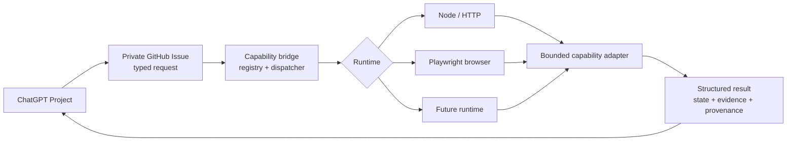
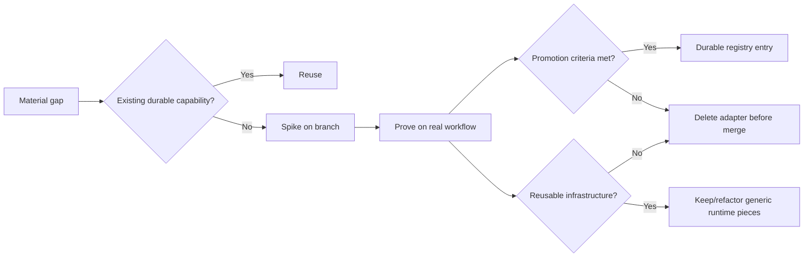

# ChatGPT GitHub Capability Bridge

A small, auditable bridge that lets ordinary ChatGPT Project chats invoke **vetted external capabilities** without exposing generic remote execution.

The bridge is use-case agnostic. Domain adapters are specific and disposable by default; only adapters that satisfy the durable-promotion rules belong in the active registry on `main`.

## At a glance



The stable abstraction is:

```text
invoke(capability_name, typed_input) -> structured result
```

GitHub Issues, Actions, Node and Playwright are implementation choices behind that contract.

## Active durable capabilities

| Capability | Runtime | Side effects | Purpose |
|---|---|---|---|
| `linkedin.job.lookup` | Node / HTTP | Read-only | Resolve one public LinkedIn job by exact numeric job ID. |

The browser runtime is available on `main`, but there is currently **no durable browser-backed adapter registered**. It was proven with a disposable private-health spike and is now regression-tested with a domain-agnostic local browser smoke test.

## Request and response

Create an owner-authored issue titled:

```text
[capability] linkedin.job.lookup
```

with a raw JSON body:

```json
{
  "version": 1,
  "capability": "linkedin.job.lookup",
  "input": {
    "job_id": "4468897387"
  }
}
```

An optional `request_id` may be supplied.

The workflow posts one issue comment beginning with `CAPABILITY_RESULT`, followed by structured JSON, then closes the issue.

## Design principles

- **Typed and bounded, not generic.** No arbitrary shell, scripts, unrestricted HTTP, or unrestricted browser control.
- **Use the simplest reliable execution path.** Prefer native/public API or direct HTTP before browser automation.
- **Read-only by default.** Consequential actions require a stronger capability-specific approval and security design.
- **Adapters are disposable by default.** A spike does not become permanent merely because it worked once.
- **Runtime and transport are replaceable.** Domain Projects should depend on capability contracts, not GitHub Actions or Playwright.
- **Structured failures matter.** Callers must be able to distinguish not-found, auth boundaries, bot blocks, timeouts, partial evidence and policy failures.

## Safety properties

- private repository;
- only owner-authored `[capability]` issues execute;
- allowlisted named capabilities;
- strict capability-specific input validation;
- handler-owned network destinations;
- no caller-controlled hosts, headers, cookies or credentials;
- HTTPS + allowlisted top-level navigation for browser capabilities;
- bounded request, response, action, navigation and runtime budgets;
- least-privilege GitHub workflow permissions;
- no persistent browser profiles, caches or credentials;
- CAPTCHA, bot and authentication boundaries are failures, not bypass targets.

## Capability lifecycle



A durable adapter must qualify through either recurring use or a documented recurring workflow requirement. CI enforces the production-registry rules.

See [`docs/capability-lifecycle.md`](docs/capability-lifecycle.md).

## Repository layout

```text
.github/workflows/
  capability-dispatch.yml
  ci.yml

capabilities/
  linkedin-job/
    handler.mjs

docs/
  design.md
  capability-lifecycle.md

protocol/
  request-response.schema.json

scripts/
  validate-registry.mjs
  smoke-browser-runtime.mjs

src/
  browser-runtime.mjs
  dispatch.mjs
  resolve-runtime.mjs

tests/
  browser-runtime.test.mjs
  linkedin-job.test.mjs

registry.json
package.json
package-lock.json
```

Directory trees stay as text; architecture, workflows, sequence and lifecycle visuals use Mermaid.

## Documentation

- [`docs/design.md`](docs/design.md) — current implementation architecture, contracts, runtime model, safety and operability.
- [`docs/capability-lifecycle.md`](docs/capability-lifecycle.md) — deterministic spike-to-durable lifecycle and CI enforcement.

Cross-project policy for when ordinary ChatGPT Projects should create or invoke external capabilities remains canonical in:

`Tech & AI/20 - Knowledge/Guides/chatgpt-capability-extension.md`

## Adding a capability

Do not add an adapter merely because one task was awkward.

Before implementation:

1. prove the gap is material and native/fallback options are insufficient;
2. check whether an existing durable capability fits;
3. define the smallest useful typed operation;
4. classify side effects and network boundaries;
5. choose the simplest runtime;
6. define verification and failure states.

Unless recurrence is already proven, implement the adapter as a **branch-only spike**. After the real workflow is tested, either promote it deliberately or delete it before merge.

Do not add generic `run_script`, shell execution, unrestricted `fetch_url`, or unrestricted browser capabilities.
