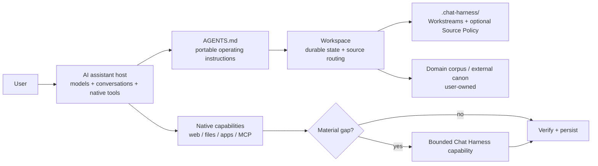

# Chat Harness

**Harness engineering for AI assistants.**

**Bring harness-level discipline to long-running work with ChatGPT, Claude and other AI assistants.**

Chat Harness is an open-source architecture and toolkit for applying harness engineering around general-purpose AI assistants. It combines context engineering, explicit durable project state, source-of-truth rules, resumable Workstreams, validation, guardrails, and bounded capability extension so substantial multi-session work is easier to resume, verify, and maintain.

It is **not another agent runtime**. The assistant still supplies its models, conversation loop, interfaces, files, connectors, tools, and native execution. Chat Harness adds the project-level engineering layer around those capabilities.

## Why it exists

Coding harnesses made a useful pattern obvious: model quality is only part of reliable long-running work. Instructions, explicit state, context selection, source ownership, verification, checkpoints, recovery, and authority boundaries matter too.

General knowledge work has the same failure modes, but moving research, travel, household administration, career work, or scientific investigation into a coding harness is often the wrong abstraction. Chat Harness applies the useful harness disciplines around the assistant people already use.

ChatGPT is the first-class v0.1 environment. The architecture is intended to map to comparable assistants, but support claims are evidence-based rather than inferred from similarity.

## Mental model



A Workspace is an **ownership and durable-state boundary**, not the complete context universe. Relevant context may live in other Workspaces, repositories, connected apps, assistant context systems, or current public sources. Retrieve it when it materially matters; keep canon in its owning source.

## Installation

Release artifacts are self-contained; the primary binary install does not require Bun or Node.

macOS / Linux:

```bash
curl -fsSL https://raw.githubusercontent.com/carlosboeing/chat-harness/main/install.sh | sh
```

PowerShell:

```powershell
irm https://raw.githubusercontent.com/carlosboeing/chat-harness/main/install.ps1 | iex
```

Both installers verify the matching SHA-256 sidecar before installing. Set `CHAT_HARNESS_VERSION` to pin a release or `CHAT_HARNESS_INSTALL_DIR` to choose the destination.

The secondary npm channel is:

```bash
npm install -g chat-harness
```

The npm package is a secondary distribution channel and requires Node 22.12+; standalone GitHub Release binaries remain the primary installation path.

## Quick start

The v0.1 CLI operates on one **local filesystem directory**.

```bash
chat-harness setup /path/to/project
chat-harness validate /path/to/project
chat-harness doctor /path/to/project
```

Or run from the target directory:

```bash
chat-harness setup
chat-harness validate
chat-harness doctor
```

`setup` creates only the minimum missing scaffold:

```text
<Project>/
├── .chat-harness/
│   ├── README.md
│   └── workstreams/
└── AGENTS.md
```

It is intentionally brownfield-safe: it does not reorganize domain content or silently rewrite existing human-authored Markdown. Once instantiated, `AGENTS.md` and the Workspace Map are user-owned.

See [Concepts](docs/concepts.md) and [Architecture](docs/architecture.md) for the model, and [ChatGPT host setup](docs/hosts/chatgpt.md) for the current reference binding.

## The operating loop

For substantial work, the assistant:

1. applies `AGENTS.md`;
2. orients from the request, Workspace Map, and relevant Workstream;
3. retrieves high-signal authoritative context, then broadens when material;
4. reverifies volatile facts;
5. uses the simplest sufficient authorized capability;
6. verifies results and evidence;
7. preserves valuable outputs and leaves durable resumable state.

A Workstream records **where the work is now**, not every conversation that led there.

## Source ownership and Source Policy

`.chat-harness/README.md` is the human-readable Workspace Map. It points to authoritative sources without imposing a root taxonomy.

An optional `.chat-harness/source-policy.yaml` adds a narrow machine-readable privacy classification for user-owned sources. V0.1 supports `public`, `personal`, `confidential`, and `restricted` handling profiles with exact paths or trailing `/**` subtree selectors.

Source Policy is not an IAM system. Chat Harness can deterministically enforce it only on retrieval paths it controls; host-native tools may provide policy-aware behaviour rather than hard enforcement. See [Security](docs/security.md).

## CLI

| Command | Purpose |
|---|---|
| `setup` | Reconcile the minimal Chat Harness scaffold without overwriting user-owned content. |
| `validate` | Check deterministic Workspace, Workstream, lifecycle, Source Policy, and capability invariants. |
| `doctor` | Diagnose local operational prerequisites without mutating the Workspace. |

All three share stable findings and machine-readable JSON semantics. `validate` and `doctor` support `--json`; terminal output is line-oriented and honours `NO_COLOR` / `--no-color`.

## Bounded capability extension

Native assistant capabilities come first. When a real gap remains, Chat Harness can expose a specific typed external capability rather than generic remote execution.

The repository includes one concrete path under `extensions/github/`: an owner-gated GitHub Issue → Actions transport for public-data, no-credential, read-only capabilities. Its current durable capability is `linkedin.job.lookup`.

The GitHub transport is **persistent**: Issue bodies and result comments become repository data. The registry therefore rejects private/sensitive, credential-bearing, write, consequential, or otherwise unapproved profiles before handler execution.

The shared Playwright helper constrains top-level navigation and execution budgets, but it is **not claimed to be a complete network-egress sandbox**.

See [Capability lifecycle](docs/capability-lifecycle.md).

## Compatibility

Support is tracked as `documented`, `verified`, or `unverified`, with the actual instruction/context path recorded. Architectural applicability alone is not a support claim.

ChatGPT web is the v0.1 reference path. Current vendor documentation describes project-scoped instructions, Project sources, connected apps, and Google Drive access; the end-to-end Chat Harness binding remains unverified until the release smoke is recorded.

See [Compatibility](docs/compatibility.md) and [ChatGPT host setup](docs/hosts/chatgpt.md).

## What Chat Harness does not build

V0.1 deliberately does not include:

- a model-provider abstraction or replacement agent loop;
- a chat UI, daemon, scheduler, workflow engine, or control plane;
- a vector-memory/global personal-knowledge database;
- a generic provider hierarchy or `WorkspaceBackend` API;
- a generic unrestricted browser, HTTP, shell, or script capability;
- remote Workspace synchronization or Google Drive management in the CLI;
- automatic hosted Project Instructions configuration;
- a Workspace manifest, migration framework, or template-sync engine;
- a full-screen TUI.

These are not missing abstractions waiting to be filled by default. They require real implementation pressure.

## Documentation

- [Architecture](docs/architecture.md)
- [Concepts](docs/concepts.md)
- [Security](docs/security.md)
- [Compatibility](docs/compatibility.md)
- [ChatGPT host binding](docs/hosts/chatgpt.md)
- [Alternatives and fit](docs/alternatives.md)
- [Capability lifecycle](docs/capability-lifecycle.md)
- [Capability bridge origin](docs/design-history/capability-bridge-origin.md)

Examples and behavioural evals are added as separate surfaces: examples teach how the system feels; evals test specific claims.

## Development

Development uses Bun and strict TypeScript.

```bash
bun install --frozen-lockfile
bun run typecheck
bun run validate
bun test
bun run smoke:browser
```

The primary distribution is self-contained standalone binaries; the npm/Node path is a secondary compatibility channel.
