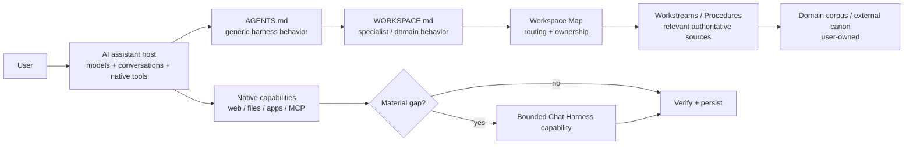

# Chat Harness

**Harness engineering for AI assistants.**

**Bring harness-level discipline to long-running work with ChatGPT, Claude and other AI assistants.**

Chat Harness is an open-source architecture and toolkit for applying harness engineering around general-purpose AI assistants. It combines context engineering, explicit durable project state, source-of-truth rules, resumable Workstreams, validation, guardrails, and bounded capability extension so substantial multi-session work is easier to resume, verify, and maintain.

It is **not another agent runtime**. The assistant still supplies its models, conversation loop, interfaces, files, connectors, tools, and native execution. Chat Harness adds the project-level engineering layer around those capabilities.

## Why it exists

Coding harnesses made a useful pattern obvious: model quality is only part of reliable long-running work. Instructions, explicit state, context selection, source ownership, verification, checkpoints, recovery, and authority boundaries matter too.

General knowledge work has the same failure modes. A research project can lose its rationale between chats. A finance workspace can accidentally duplicate stale facts. A travel plan can blur proposed and confirmed bookings. A technical investigation can reconstruct state from memory instead of resuming from the last verified checkpoint.

Moving all of that work into a coding harness is possible, but often the wrong abstraction. Chat Harness brings the useful discipline of coding-agent harnesses to the general-purpose assistant people already use.

The design principle is simple:

> **Use the host before building more framework.**

ChatGPT, Claude, and similar assistants already provide models, conversation interfaces, native tools, files, web access, connectors, and increasingly capable execution. Chat Harness adds the durable workspace and operating discipline around them instead of rebuilding those things.

## Mental model



A Workspace is an **ownership and durable-state boundary**, not the complete context universe. Relevant authorized context may live in repositories, connected apps, other Workspaces, assistant context systems, or current public sources. Retrieve it when it materially matters; keep canon in its owning source.

## What setup creates

```text
<Project>/
├── AGENTS.md
├── _inbox/
└── .chat-harness/
    ├── WORKSPACE.md
    ├── README.md
    ├── source-policy.yaml
    ├── workstreams/
    ├── workbench/
    │   ├── 0-ideas/
    │   ├── 1-research/
    │   ├── 2-analysis/
    │   ├── 3-plans/
    │   └── 4-reviews/
    ├── procedures/
    └── temp/
```

The harness owns this small working structure. **Your domain corpus remains yours.** Chat Harness does not require universal folders such as `Knowledge`, `Research`, `Projects`, or `Profile`, and it does not reorganize an existing corpus to make it look like one.

The main pieces have deliberately different ownership:

- **`AGENTS.md`** — canonical, self-contained generic Chat Harness behavior. Chat Harness-managed.
- **`.chat-harness/WORKSPACE.md`** — the Workspace-specific role, judgement, evidence standards, boundaries, and approval rules. Seeded during setup, then user-owned.
- **`.chat-harness/README.md`** — the **Workspace Map**: a compact routing/index document pointing to authoritative sources and important locations. User-owned.
- **Workstreams** — compact current resume state for continuing objectives.
- **Workbench** — substantial working artifacts such as research, analysis, plans, and reviews.
- **Procedures** — reusable methodology for recurring tasks.
- **Source Policy** — narrow machine-readable privacy/source-handling rules.

For substantial work, the retrieval path is intentionally selective:

```text
AGENTS / Project Instructions
        ↓
WORKSPACE.md
        ↓
Workspace Map
        ↓
matching Workstream / Procedure / authoritative sources
```

The goal is not to load the whole Workspace. It is to recover the right state and the minimum authoritative context needed for the task.

## Specialists

A specialist gives a new Workspace a strong starting `WORKSPACE.md` for a domain. It is a **setup-time seed, not a runtime mode or agent persona**. Once created, the file is yours to evolve.

Built-in specialists:

| Specialist | Designed for |
|---|---|
| `general` | General knowledge work with strong factual, source, and currentness discipline |
| `research` | Evidence-heavy investigation, provenance, contradictory evidence, and uncertainty |
| `tech` | Staff+/Principal engineering work, real repositories, operability, security, cost, and pragmatic design |
| `tax` | Jurisdiction- and tax-period-aware work with primary-source and factual-integrity discipline |
| `finance` | Goals, horizon, liquidity, risk, fees, tax, scenarios, and product/provider evidence |
| `career` | Evidence-grounded positioning without invented achievements, metrics, or scope |
| `shopping` | Buyer-fit research, broad discovery, true net cost, reliability, support, and current terms |
| `travel` | Traveller-specific planning, realistic logistics, current entry/schedule facts, and booking boundaries |

```bash
chat-harness setup /path/to/project --specialist tech
```

If you omit `--specialist`, interactive setup asks and defaults to `general`; non-interactive setup uses `general` deterministically.

Specialists do not install procedures, create runtime inheritance, or lock the Workspace to a template. Optional domain folders are separate and opt-in.

See [Specialists](docs/specialists.md) for the design, domain guidance, and setup behavior.

## Installation

Standalone release binaries are the primary distribution and do not require Bun or Node.

macOS / Linux:

```bash
curl -fsSL https://raw.githubusercontent.com/carlosboeing/chat-harness/main/install.sh | sh
```

PowerShell:

```powershell
irm https://raw.githubusercontent.com/carlosboeing/chat-harness/main/install.ps1 | iex
```

Both installers verify the matching SHA-256 sidecar before installing. Set `CHAT_HARNESS_VERSION` to pin a release or `CHAT_HARNESS_INSTALL_DIR` to choose the destination.

The secondary npm channel requires Node 22.12+:

```bash
npm install -g chat-harness
```

Development uses Bun 1.4.2+.

## Quick start

```bash
chat-harness setup /path/to/project --specialist tech
chat-harness validate /path/to/project
chat-harness doctor /path/to/project
```

Or run the commands from the target directory.

Setup is deliberately brownfield-safe. It creates missing managed paths, preserves user-owned Workspace/domain content, refreshes a recognizably Chat Harness-managed `AGENTS.md`, and refuses to silently adopt an unknown `AGENTS.md` collision.

For ChatGPT Projects, there is one manual host-binding step the CLI cannot perform: copy the **entire current `AGENTS.md`** into Project Instructions. Keep specialist/domain behavior in `WORKSPACE.md`; do not merge it into Project Instructions.

See [Getting started](docs/README.md#start-here) and [ChatGPT host binding](docs/hosts/chatgpt.md).

## The operating loop

For substantial work, the assistant should:

1. apply `AGENTS.md` and load `WORKSPACE.md` plus the Workspace Map;
2. determine whether the task continues an existing objective;
3. inspect relevant active or parked Workstreams **before** reconstructing state from chat history or model memory;
4. resume the matching Workstream from its `Next action`, or create one early when the task qualifies;
5. retrieve only the relevant Procedures and authoritative sources;
6. reverify volatile facts where currentness matters;
7. use the simplest sufficient authorized capability;
8. checkpoint material decisions, findings, blockers, artifacts, and next-action changes;
9. reconcile durable state before substantial handoff.

A useful Workstream heuristic is:

> **independent objective + independent next action + likely future continuation**

A Workstream records **where the work is now**, not every conversation that led there.

## Workstreams and Workbench

Workstreams and Workbench solve different problems.

```text
                         ┌──────────────► Workstream
Chat(s) ─────────────────┼──────────────► Workbench
                         └──────────────► Domain corpus
```

A **Workstream** is compact, continuously maintained resume state: objective, current direction, material rationale, blockers/open questions, relevant sources/artifacts, and an explicit Next action.

The **Workbench** holds substantial durable working artifacts:

- `0-ideas/` — brainstorms, hypotheses, questions, option generation;
- `1-research/` — discovery, evidence collection, investigations, experiments;
- `2-analysis/` — synthesis, comparison, design, strategy, modelling;
- `3-plans/` — implementation, action, booking, compliance, experiment plans;
- `4-reviews/` — reviews, audits, critiques, evaluations, retrospectives.

Those folders are organizational classes, **not workflow phases**. Work does not have to move through them in order.

## Source ownership and Source Policy

Chat Harness treats source ownership as part of reliability. A summary, search result, model memory, or convenient copy does not become authoritative merely because it is easy to retrieve.

`.chat-harness/source-policy.yaml` adds narrow machine-readable privacy/source-handling rules. It is not a general configuration file and not an IAM system.

Chat Harness can mechanically enforce Source Policy only on access paths it controls. Host-native retrieval may be instruction-governed where no enforcement hook exists. The documentation does not claim stronger enforcement than the implementation provides.

See [Security and trust boundaries](docs/security.md).

## CLI

| Command | Purpose |
|---|---|
| `setup` | Reconcile the Chat Harness scaffold and optionally seed a specialist/domain layout. |
| `validate` | Validate deterministic Workspace, Workstream, Source Policy, and capability invariants. |
| `doctor` | Diagnose local prerequisites without mutating the Workspace. |

There is deliberately no workflow engine, provider abstraction, specialist runtime, migration database, or generic unrestricted execution layer.

## Bounded capability extension

Native assistant capabilities come first. When a real deterministic gap remains, Chat Harness can expose a specific typed external capability rather than generic arbitrary execution.

The repository includes one concrete reference path under `extensions/github/`: an owner-gated GitHub Issue → Actions transport for public-data, no-credential, read-only capabilities. Its durable capability is `linkedin.job.lookup`.

That extension demonstrates the boundary; it is not the center of the architecture. Chat Harness does not turn every native tool into its own provider abstraction.

See [Capability lifecycle](docs/capability-lifecycle.md).

## What Chat Harness does not build

Chat Harness deliberately does not build these things without demonstrated implementation pressure:

- another model-provider abstraction or replacement agent loop;
- another chat UI, daemon, scheduler, workflow engine, or control plane;
- a vector-memory/global personal-knowledge database;
- a universal domain taxonomy;
- runtime specialist inheritance or multi-specialist composition;
- a generic unrestricted browser, HTTP, shell, or script capability;
- automatic hosted Project Instructions configuration;
- a semantic migration engine or template-sync framework.

These are not missing boxes waiting to be filled. Keeping the harness small is part of the design.

## Documentation

Start with the [documentation guide](docs/README.md).

- [Architecture](docs/architecture.md) — system boundaries, ownership, recovery, and extension model
- [Concepts](docs/concepts.md) — concise vocabulary
- [Specialists](docs/specialists.md) — built-in specialist seeds and how to use them
- [ChatGPT host binding](docs/hosts/chatgpt.md) — connect a Workspace to a ChatGPT Project
- [Security](docs/security.md) — Source Policy, authority, trust boundaries, and extension security
- [Compatibility](docs/compatibility.md) — what is documented, verified, or still unverified
- [Alternatives and fit](docs/alternatives.md) — when Chat Harness is or is not the right layer
- [Capability lifecycle](docs/capability-lifecycle.md) — how bounded external capabilities earn permanence

Historical release and design records are kept separately from current user documentation.

## Development

```bash
bun install --frozen-lockfile
bun run typecheck
bun run validate
bun run validate:docs
bun run validate:evals
bun run test
```

See [CONTRIBUTING.md](CONTRIBUTING.md) before proposing architecture or capability changes.
