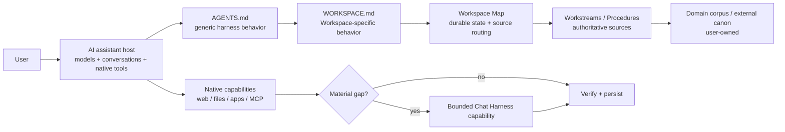

# Chat Harness

[](https://github.com/carlosboeing/chat-harness/releases)
[](https://github.com/carlosboeing/chat-harness/actions/workflows/ci.yml)
[](https://www.npmjs.com/package/chat-harness)
[](LICENSE)
[](https://github.com/carlosboeing/chat-harness/releases)

**Harness engineering for AI assistants.**

**Bring harness-level discipline to long-running work with ChatGPT, Claude and other AI assistants.**

Chat Harness is an open-source architecture and toolkit for applying harness engineering around general-purpose AI assistants. It combines context engineering, explicit durable project state, source-of-truth rules, resumable Workstreams, validation, guardrails, and bounded capability extension so substantial multi-session work is easier to resume, verify, and maintain.

It is **not another agent runtime**. The assistant still supplies its models, conversation loop, interfaces, files, connectors, tools, and native execution. Chat Harness adds the project-level engineering layer around those capabilities.

## Why it exists

Coding harnesses made a useful pattern obvious: model quality is only part of reliable long-running work. Instructions, explicit state, context selection, source ownership, verification, checkpoints, recovery, and authority boundaries matter too.

General knowledge work has the same failure modes, but moving research, travel, household administration, career work, or scientific investigation into a coding harness is often the wrong abstraction. Chat Harness applies the useful harness disciplines around the assistant people already use.

The design principle is simple: **use the host before building more framework**. ChatGPT, Claude, and similar assistants already provide the models, interfaces, native tools, files, connectors, and execution. Chat Harness focuses on the project-level discipline around them.

## Mental model



A Workspace is an **ownership and durable-state boundary**, not the complete context universe. Relevant context may live in other Workspaces, repositories, connected apps, assistant context systems, or current public sources. Retrieve it when it materially matters; keep canon in its owning source.

## Installation

Release binaries are self-contained; the primary install does not require Bun or Node.

macOS / Linux:

```bash
curl -fsSL https://raw.githubusercontent.com/carlosboeing/chat-harness/main/install.sh | sh
```

PowerShell:

```powershell
irm https://raw.githubusercontent.com/carlosboeing/chat-harness/main/install.ps1 | iex
```

Both installers verify the matching SHA-256 sidecar. Set `CHAT_HARNESS_VERSION` to pin a release or `CHAT_HARNESS_INSTALL_DIR` to choose the destination.

The secondary npm channel requires Node 22.12+:

```bash
npm install -g chat-harness
```

Verify the CLI you are actually running:

```bash
chat-harness --version
```

To upgrade an npm installation later:

```bash
npm install -g chat-harness@latest
```

For a standalone installation, rerun the installer; it downloads the current release unless `CHAT_HARNESS_VERSION` is pinned.

## Quick start

The normal workflow is to run Chat Harness **from inside the folder you want to use as a Workspace**:

```bash
cd /path/to/your/project
chat-harness setup --specialist tech
chat-harness validate
chat-harness doctor
```

The path is optional. You can target another existing directory explicitly when needed:

```bash
chat-harness setup /path/to/your/project --specialist tech
```

Chat Harness does not search parent directories for a Workspace.

`setup` creates the Chat Harness working scaffold without reorganizing your domain content:

```text
<Project>/
├── AGENTS.md
├── _inbox/
└── .chat-harness/
    ├── WORKSPACE.md
    ├── README.md
    ├── source-policy.yaml
    ├── workstreams/
    ├── workbench/
    │   ├── 0-ideas/
    │   ├── 1-research/
    │   ├── 2-analysis/
    │   ├── 3-plans/
    │   └── 4-reviews/
    ├── procedures/
    └── temp/
```

It is intentionally brownfield-safe: existing user-owned Workspace and domain content is preserved, a recognizably Chat Harness-managed `AGENTS.md` can be refreshed, and unknown same-name content is never silently adopted.

Creating the files is only the local half of setup. To use the Workspace with **ChatGPT Projects**:

1. add the Workspace's Google Drive folder to the ChatGPT Project as a source;
2. copy the **entire current `AGENTS.md`** into ChatGPT Project Instructions.

The CLI cannot perform those hosted UI steps for you. Follow the beginner-friendly [Getting Started guide](docs/getting-started.md) or the illustrated [ChatGPT setup guide](docs/hosts/chatgpt.md).

## How a Workspace works

The scaffold separates generic harness behavior from Workspace-specific knowledge and judgement:

- **`AGENTS.md`** — generic Chat Harness operating behavior.
- **`WORKSPACE.md`** — Workspace-specific role, judgement, evidence standards, boundaries, and approvals.
- **Workspace Map** (`.chat-harness/README.md`) — human-readable routing to authoritative sources, important locations, Procedures, and Workstreams.
- **Workstreams** — compact current resume state for continuing objectives.
- **Workbench** — substantial working artifacts such as research, analysis, plans, and reviews.
- **Procedures** — reusable methodology for recurring tasks.
- **Source Policy** — narrow machine-readable privacy/source-handling rules.

For substantial work, the assistant follows a selective retrieval path:

```text
AGENTS / Project Instructions
        ↓
WORKSPACE.md
        ↓
Workspace Map
        ↓
matching Workstream / Procedure / authoritative sources
```

The goal is not to load everything. It is to recover the right state and the minimum authoritative context needed for the task.

## Specialists

A specialist gives a new Workspace domain-specific starting guidance by seeding `WORKSPACE.md`. It is **not a separate agent or runtime mode**; after setup, the file is yours to adapt.

Built-in specialists are `general`, `research`, `tech`, `tax`, `finance`, `career`, `shopping`, and `travel`.

```bash
chat-harness setup /path/to/project --specialist research
```

Specialists capture durable domain judgement and evidence standards. Procedures remain separate: a specialist describes **how the Workspace generally works**; a Procedure describes **how a recurring task is performed**.

See [Specialists](docs/specialists.md) for the built-in seeds and setup behavior.

## The operating loop

For substantial work, the assistant:

1. applies `AGENTS.md` and the Workspace-specific instructions;
2. orients from the request, Workspace Map, and relevant Workstream;
3. inspects matching durable state before reconstructing it from chat history or model memory;
4. retrieves high-signal authoritative context, then broadens when material;
5. reverifies volatile facts;
6. uses the simplest sufficient authorized capability;
7. verifies results and evidence;
8. preserves valuable outputs and leaves durable resumable state.

A useful Workstream heuristic is:

> **independent objective + independent next action + likely future continuation**

A Workstream records **where the work is now**, not every conversation that led there.

## Workstreams and Workbench

Workstreams and Workbench are parallel outputs from work.

A **Workstream** is compact, continuously maintained resume state: objective, current direction, material rationale, blockers/open questions, relevant sources/artifacts, and an explicit Next action.

The **Workbench** holds substantial durable working artifacts under five organizational categories: ideas, research, analysis, plans, and reviews. These are not workflow phases and work does not need to move through them in order.

## Source ownership and Source Policy

Chat Harness treats source ownership as part of reliability. Search results, assistant memory, summaries, and derived reports do not become authoritative merely because they are convenient.

`.chat-harness/source-policy.yaml` adds narrow machine-readable privacy/source-handling rules. Source Policy is not IAM or a general configuration system. Chat Harness can mechanically enforce it only on access paths it controls; host-native retrieval may be instruction-governed where no enforcement hook exists.

See [Security](docs/security.md).

## Usage

All commands accept an optional `[path]`. When it is omitted, Chat Harness uses the current directory.

| Command | What it does | Typical use |
|---|---|---|
| `chat-harness setup` | Create or safely reconcile the Workspace scaffold. | First-time setup or refreshing managed files. |
| `chat-harness validate` | Check the scaffold, Workstreams, and Source Policy without changing files. | Confirm the Workspace still satisfies Chat Harness contracts. |
| `chat-harness doctor` | Check Workspace health and local prerequisites without changing files. | Diagnose environment or installation problems. |

Interactive `setup` explains choices before asking for consent and shows the exact create/replace plan before writing.

Common setup options:

| Option | What it means |
|---|---|
| `--specialist <id>` | Start `WORKSPACE.md` with guidance for `general`, `research`, `tech`, `tax`, `finance`, `career`, `shopping`, or `travel`. |
| `--scaffold-domain` | Also create the selected specialist's optional starter folders. |
| `--dry-run` | Show what setup would change without writing anything. |
| `--replace-agents` | Explicitly overwrite an unmanaged existing `AGENTS.md`. |
| `--replace-workspace` | Explicitly overwrite `WORKSPACE.md` with the selected specialist seed. |
| `--json` | Emit stable machine-readable output; for setup, this also disables interactive prompts. |
| `--no-color` | Disable ANSI terminal decoration. |

Examples:

```bash
chat-harness setup
chat-harness setup --specialist travel
chat-harness setup --specialist tech --scaffold-domain
chat-harness setup --dry-run
chat-harness validate --json
chat-harness doctor
```

Run `chat-harness --help` or `chat-harness <command> --help` for terminal help. See the complete [CLI reference](docs/cli.md) for behavior, safety rules, automation, and exit codes.

## Bounded capability extension

Native assistant capabilities come first. When a real gap remains, Chat Harness can expose a specific typed external capability rather than generic remote execution.

The repository includes one concrete reference path under `extensions/github/`: an owner-gated GitHub Issue → Actions transport for public-data, no-credential, read-only capabilities. Its current durable capability is `linkedin.job.lookup`.

The GitHub transport is persistent repository data, so its security profile is deliberately narrow. The shared Playwright helper is bounded but is **not claimed to be a complete network-egress sandbox**.

See [Capability lifecycle](docs/capability-lifecycle.md).

## Compatibility

Support is tracked as `documented`, `verified`, or `unverified`; architectural similarity alone is not a support claim.

ChatGPT Projects are the reference hosted binding. Other assistants can use the architecture where equivalent instruction, context, and capability primitives exist, but support remains evidence-based.

See [Compatibility](docs/compatibility.md).

## What Chat Harness does not build

Chat Harness deliberately does not include a replacement agent loop, model-provider abstraction, chat UI, daemon, scheduler, workflow engine, global memory database, universal domain taxonomy, runtime specialist hierarchy, generic unrestricted browser/HTTP/shell capability, or automatic hosted Project configuration.

These are not missing abstractions waiting to be filled by default. They require real implementation pressure.

## Documentation

Start with the [Getting Started guide](docs/getting-started.md) or the [documentation guide](docs/README.md).

- [CLI reference](docs/cli.md)
- [Architecture](docs/architecture.md)
- [Concepts](docs/concepts.md)
- [Specialists](docs/specialists.md)
- [Security](docs/security.md)
- [Compatibility](docs/compatibility.md)
- [ChatGPT host binding](docs/hosts/chatgpt.md)
- [Alternatives and fit](docs/alternatives.md)
- [Capability lifecycle](docs/capability-lifecycle.md)

The repository also includes [worked examples](examples/) and [behavioural evals](evals/README.md). Historical release and design records are kept separately from current user documentation.

## Development

Development uses Bun and strict TypeScript.

```bash
bun install --frozen-lockfile
bun run typecheck
bun run validate
bun run validate:docs
bun run validate:evals
bun run test
```

See [CONTRIBUTING.md](CONTRIBUTING.md) for development and release guidance.
