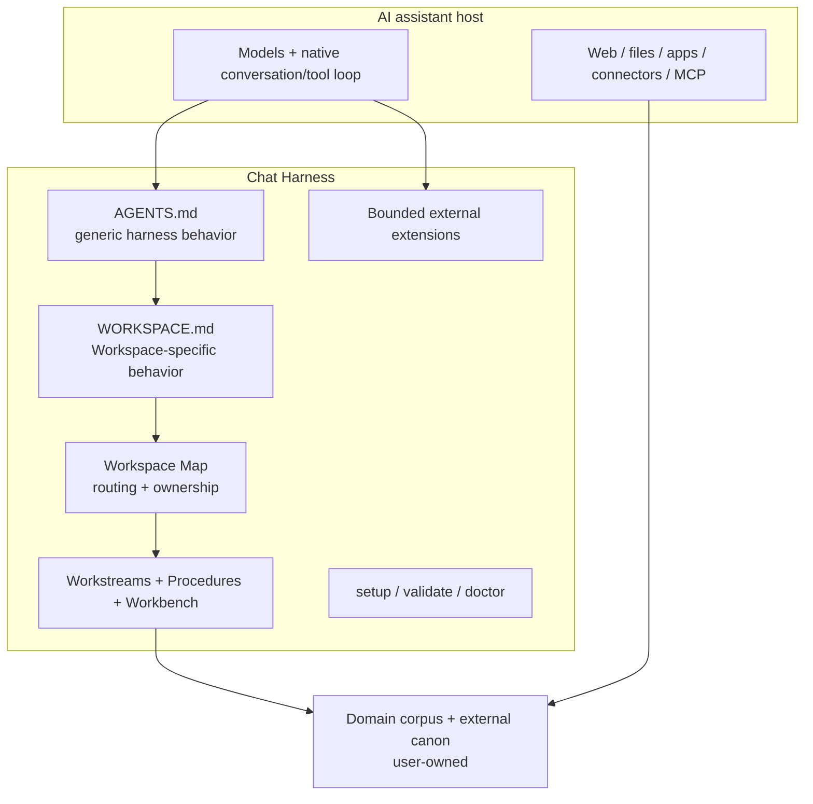

# Architecture

Chat Harness applies harness engineering around an existing AI assistant. The host owns the model, native conversation/tool loop, UI, and built-in capabilities. Chat Harness owns the project-level conventions and deterministic tooling that make long-running work easier to resume, verify, and maintain.

It is intentionally a layer **around** the host, not a replacement runtime.

## Boundary



Chat Harness is not an agent runtime, orchestration platform, or memory database. It shapes execution around the host rather than reimplementing it.

## Workspace structure

The normal scaffold is:

```text
<Project>/
├── AGENTS.md
├── _inbox/
└── .chat-harness/
    ├── WORKSPACE.md
    ├── README.md
    ├── source-policy.yaml
    ├── workstreams/
    ├── workbench/
    │   ├── 0-ideas/
    │   ├── 1-research/
    │   ├── 2-analysis/
    │   ├── 3-plans/
    │   └── 4-reviews/
    ├── procedures/
    └── temp/
```

The user/domain owns the rest of the corpus. Chat Harness standardizes its own working namespace and routing semantics; it does not impose a universal filing system on research, code, finances, career records, travel, or other domain content.

## Instruction ownership

### AGENTS.md

`AGENTS.md` is the canonical, self-contained generic Chat Harness instruction artifact. A deterministic managed marker lets setup recognize a Chat Harness-owned copy and refresh it wholesale.

An unknown or unmanaged `AGENTS.md` is a brownfield collision. Setup preserves it and requires an explicit adoption/replacement choice rather than silently assigning Chat Harness ownership.

For hosts that can consume `AGENTS.md` directly, this is the portable instruction source. ChatGPT uses a narrow manual binding: copy the complete file into Project Instructions.

### WORKSPACE.md

`.chat-harness/WORKSPACE.md` is the single Workspace-specific instruction extension. It owns the specialist/domain role, expertise, judgement style, evidence/currentness standards, invariants, output expectations, boundaries, and domain-specific approval constraints.

A [specialist](specialists.md) seeds this file during setup. After that, the file is user-owned. There is no specialist inheritance, composition, runtime precedence, or template synchronization.

### Workspace Map

`.chat-harness/README.md` is the Workspace Map: compact user-owned routing/index state pointing to authoritative domain sources, important locations, Procedures, and Workstreams.

It is not another instruction file and not a machine configuration manifest.

## Runtime retrieval and recovery

For substantial work, the intended retrieval chain is:

```text
AGENTS / Project Instructions
        ↓
WORKSPACE.md
        ↓
Workspace Map
        ↓
matching Workstream / Procedure / authoritative sources
```

The host should:

1. load `WORKSPACE.md` and the Workspace Map;
2. decide whether the request continues an existing objective;
3. inspect relevant active or parked Workstreams **before** reconstructing state from chat history or model memory;
4. resume a matching Workstream from its explicit Next action;
5. create a Workstream early when a new objective qualifies;
6. load only the relevant Procedure and canonical sources;
7. checkpoint material changes;
8. reconcile durable state before substantial handoff.

A new Workstream is justified by:

> **independent objective + independent next action + likely future continuation**

A Workstream is authoritative resume state for its objective, but it never overrides stronger canonical domain evidence. If authoritative evidence shows the Workstream is stale, reconcile the Workstream.

## Workstream vs Workbench

A Workstream is compact, continuously maintained current objective state. Workbench contains substantial durable working artifacts produced during chats.

```text
                         ┌──────────────► Workstream
Chat(s) ─────────────────┼──────────────► Workbench
                         └──────────────► Domain corpus
```

Workbench categories are organizational classes, not lifecycle phases:

- ideas;
- research;
- analysis;
- plans;
- reviews.

Workstreams may reference Workbench artifacts. Workbench artifacts may later be promoted into canonical domain ownership.

## Inbox and temp

`_inbox/` is visible **human/automation → assistant intake**. Its contents are user-owned and are not disposable merely because they are in Inbox.

`.chat-harness/temp/` is **assistant → assistant transient workspace**. It is non-canonical. It may hold scratch material or costly-to-regenerate intermediate state when a recovery boundary is useful.

Before substantial closeout, valuable output should be promoted to Workbench or canonical domain ownership and disposable harness-created temp material may be cleaned.

## Federated context and source ownership

A Workspace is an ownership/resume boundary, not an information silo. Authorized context may come from the current Workspace, other Workspaces, repositories, connected applications, assistant context systems, or current public sources.

Canonical ownership stays explicit. Prefer retrieving or referencing authoritative external canon over creating stale competing copies.

Before creating a new canonical durable artifact, perform a targeted ownership check against the relevant canonical layer. Keep it proportional; do not scan the universe before every write.

## Source Policy

`.chat-harness/source-policy.yaml` is part of the normal scaffold and has a narrow job: machine-readable privacy/source-handling policy.

It is not the place for specialist behavior, source-of-truth hierarchy, evidence quality, currentness, procedure routing, approvals, workflow, or model choice.

For Chat Harness-controlled reads, policy can be resolved before protected content access. For host-native retrieval paths Chat Harness does not intercept, the policy may be instruction-governed rather than mechanically enforced. See [Security](security.md).

## Setup and brownfield safety

Setup follows explicit ownership:

- missing managed path → create;
- recognized Chat Harness-managed path → operate according to its ownership contract;
- unknown/unmanaged same-name user content → preserve and surface the conflict;
- existing `WORKSPACE.md`, Workspace Map, Source Policy, and domain corpus → preserve unless the user explicitly requests an applicable replacement;
- optional domain scaffold → exact additive paths only.

Setup does not rename, move, merge, fuzzy-match, or semantically reorganize an existing domain corpus.

## Capability model

`Capability` is broad: native assistant tools, apps/connectors, MCP, and Chat Harness-managed extensions can all be capabilities.

Chat Harness does not wrap native host tools behind a provider abstraction merely for symmetry. Escalation is intentionally simple:

```text
native assistant capability
  → app / connector
  → MCP or comparable host extension
  → Chat Harness-managed bounded capability
  → specialist worker when genuinely needed
```

A durable external capability has a stable identity, strict typed request, authority/security profile, handler-owned network policy, execution budgets, structured failure/result semantics, and lifecycle evidence.

The repository's GitHub extension is one implementation of this bounded extension boundary, not the center of the architecture.

## Authority and transparency

Autonomous read execution requires a capability to be safe, already authorized, and read-only. Consequential actions require explicit human approval at the action boundary unless that action has already been explicitly authorized.

Portable instructions also require action transparency before meaningful external mutations and proportional notice before non-obvious private/sensitive cross-context reads. Routine internal mechanics are not narrated.

## Non-goals

Chat Harness deliberately has no replacement agent loop, model-provider abstraction, workflow engine, scheduler, universal domain taxonomy, runtime specialist hierarchy, Workspace version database, semantic migration engine, generic unrestricted shell/HTTP/browser capability, or memory/RAG layer merely for architectural completeness.

Those abstractions should be earned by real implementation pressure.

## Related documentation

- [Concepts](concepts.md)
- [Specialists](specialists.md)
- [Security](security.md)
- [Compatibility](compatibility.md)
- [ChatGPT host binding](hosts/chatgpt.md)
- [Alternatives and fit](alternatives.md)
