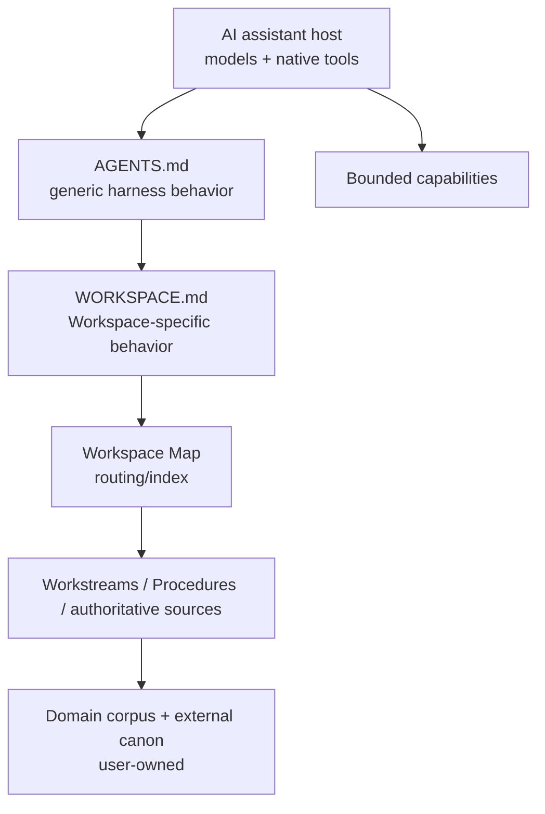

# Architecture

Chat Harness shapes execution around an existing AI assistant rather than replacing its model/tool loop.

## Boundary



## v0.2 core scaffold

```text
<Project>/
├── AGENTS.md
├── _inbox/
└── .chat-harness/
    ├── WORKSPACE.md
    ├── README.md
    ├── source-policy.yaml
    ├── workstreams/
    ├── workbench/
    │   ├── 0-ideas/
    │   ├── 1-research/
    │   ├── 2-analysis/
    │   ├── 3-plans/
    │   └── 4-reviews/
    ├── procedures/
    └── temp/
```

No universal domain taxonomy is imposed.

## Instruction ownership

`AGENTS.md` is a self-contained generic Chat Harness Project Instructions file. A deterministic managed marker allows setup to recognize and replace a Chat Harness-owned copy wholesale. Unknown `AGENTS.md` content is a brownfield collision.

`WORKSPACE.md` is the single Workspace-specific instruction extension. Specialist templates are setup-time seeds only; after creation the file is Workspace/user-owned. There is no specialist inheritance, composition, or update synchronization.

The Workspace Map is user-owned routing/index state, not instructions or machine configuration.

## Runtime recovery

For substantial work the host should load WORKSPACE + Map, determine whether the request continues an objective, inspect relevant active/parked Workstreams **before** reconstructing state from chat/memory, resume from Next action, and load only relevant Procedures/canonical sources.

A new Workstream is justified by:

> independent objective + independent next action + likely future continuation

Checkpoint only material changes. Before substantial handoff, reconcile current durable state and promote valuable transient output.

## Workstream vs Workbench

A Workstream is compact continuously maintained objective state. Workbench is durable working output.

```text
                         ┌──────────────► Workstream
Chat(s) ─────────────────┼──────────────► Workbench
                         └──────────────► Domain corpus
```

Workbench taxonomy is organizational, not lifecycle state. v0.2 has no lifecycle validator, phase engine, or v0.1 migration layer.

## Inbox and temp

`_inbox/` is human/automation → assistant intake and remains user-owned.

`.chat-harness/temp/` is assistant → assistant non-canonical transient storage. Valuable content should be promoted before closeout; disposable harness-created temp material may be cleaned.

## Source ownership and Source Policy

The Workspace is federated rather than siloed. Canonical ownership remains explicit across repositories, apps, other Workspaces, and public sources.

Source Policy remains narrow privacy/source-handling configuration. Deterministic enforcement applies only to paths Chat Harness controls; host-native reads may only be instruction-governed.

## Setup and brownfield safety

Setup follows explicit ownership:
- missing core path → create;
- recognized Chat Harness-owned AGENTS → refresh wholesale;
- unknown same-name user content → preserve and surface;
- existing WORKSPACE/Map/Source Policy → user-owned unless explicit replacement is requested;
- optional domain scaffold → exact additive paths only.

There is no v0.1 detector, migrator, lifecycle converter, upgrade command, or version database. Old `.chat-harness/lifecycle/` content, if present, is ignored as unrelated extra content.

## Capability/security boundary

The Workspace redesign does not weaken capability rules: host-native capability first, bounded extension only for a real gap, retrieved content is not authority, meaningful mutation is transparent, and consequential side effects require explicit approval unless already authorized.
