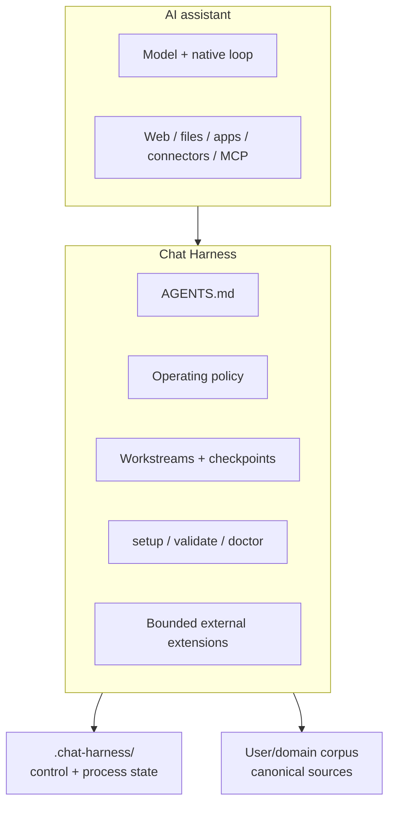

# Architecture

Chat Harness applies harness engineering around an existing AI assistant. The assistant owns the model, native conversation/tool loop, UI, and built-in capabilities. Chat Harness owns the project-level conventions and deterministic tooling that make long-running work easier to resume, verify, and maintain.

## Boundary



Chat Harness is not an agent runtime, orchestration platform, or memory database. It shapes execution around the host rather than reimplementing it.

## Workspace

A Workspace is an ownership and durable-state boundary. V0.1 uses this minimum default:

```text
<Project>/
├── .chat-harness/
│   ├── README.md
│   └── workstreams/
└── AGENTS.md
```

The user/domain owns the rest of the corpus. `.chat-harness/` constrains Chat Harness housekeeping; it is not an assistant write sandbox. User-authorized task work may update domain artifacts when source ownership, Source Policy, host permissions, and action authority permit it.

The logical architecture is storage-independent. The v0.1 CLI is deliberately narrower: it reads and writes a single local filesystem directory and does not synchronize or manage remote storage.

## Portable instructions and host binding

`AGENTS.md` is the canonical portable project-level instruction source. Filesystem-aware harnesses can consume it directly.

A host that cannot consume it directly uses a narrow host binding. The binding must make the canonical instructions effective and provide a usable path to relevant context without becoming a second instruction canon. ChatGPT Project Instructions are the v0.1 reference binding; see [ChatGPT host setup](hosts/chatgpt.md).

## Operating protocol

For substantial work:

1. apply portable instructions;
2. orient from the user request, Workspace Map, and relevant Workstream;
3. retrieve known authoritative context;
4. progressively broaden retrieval when additional authorized context could materially change the work;
5. reverify volatile facts;
6. use the simplest sufficient authorized capability;
7. verify results, failures, and evidence;
8. preserve valuable outputs and checkpoint durable state.

A Workstream is a context entry point, not an information boundary.

## Source ownership

`.chat-harness/README.md` is a human-readable Workspace Map. It records routing and ownership, not machine configuration.

A Workstream is the durable resume point for one continuing objective. Domain facts remain authoritative in the record that owns them. Search indexes, assistant memory, summaries, and derived reports do not become canon merely because they are convenient.

Before creating durable canon, perform a targeted **CREATE** ownership check. Before substantial handoff, **CLOSE** by preserving materially valuable outputs and making the active Workstream resumable.

When shared durable state may have changed, refresh and reconcile before overwriting it. V0.1 intentionally does not add locks or distributed transactions.

## Source Policy

A Workspace may add `.chat-harness/source-policy.yaml`:

```yaml
version: 1
defaults:
  privacy: personal
rules:
  - match:
      path: "Bank Statements/**"
    privacy: restricted
```

V0.1 accepts exact Workspace-relative paths and one trailing `/**` subtree selector. Exact matches beat subtree matches; longer subtree matches beat shorter ones; equally specific conflicting rules are invalid.

Privacy profiles are `public`, `personal`, `confidential`, and `restricted`. The owning Workspace's policy governs its sources and cannot be silently weakened by a consuming Workspace.

For Chat Harness-controlled source reads, policy is resolved before content access. Resolution is `resolved`, `absent`, or `unavailable`; unavailable fails closed. Host-native retrieval paths that Chat Harness cannot intercept are policy-aware rather than hard-enforced. See [Security](security.md).

## Workstreams and lifecycle

A Workstream is justified when there is an independent objective, an independent next action, and likely future continuation.

Every Workstream has exactly one H1 plus non-empty `Objective` and `Current state`; active Workstreams also require `Next action`. Status is one of `active | parked | resolved | superseded`.

Optional lifecycle artifacts preserve supporting deliberation/history. They are not a mandatory phase engine and never replace current Workstream state.

## CLI architecture

The CLI surface is intentionally only:

- `setup` — inspect → plan → dry-run/apply → verify;
- `validate` — deterministic local integrity;
- `doctor` — read-only operational diagnosis.

Setup automatically creates only unambiguous missing bootstrap/control state, is path-contained, and never treats template difference as permission to rewrite human-authored files.

## Capability model

`Capability` is broad: native assistant tools, apps/connectors, MCP, and Chat Harness-managed extensions can all be capabilities.

`CapabilityProvider` is deliberately narrower: it describes only a Chat Harness-managed external extension boundary. V0.1 does not invent a common executable interface over host-native tools.

Escalation is:

```text
native assistant capability
  -> app / connector
  -> MCP or comparable host extension
  -> Chat Harness-managed bounded capability
  -> specialist worker when genuinely needed
```

A durable external capability has a stable identity, strict typed request, authority/security profile, handler-owned network policy, execution budgets, structured failure/result semantics, and lifecycle evidence.

## GitHub extension

The first concrete managed extension is `extensions/github/`. Owner-authored Issues are a transport into GitHub Actions. Because Issue bodies/comments are persistent repository data, v0.1 accepts only capabilities whose machine-enforced profile is public-data, no-credential, read-only, and explicitly persistent-transport-safe.

The GitHub extension is one implementation of the bounded extension boundary, not the center of the architecture.

## Authority and transparency

Autonomous read execution requires a capability to be safe, already authorized, and read-only. Consequential actions require explicit human approval at the action boundary.

Portable instructions also require **Action Transparency** before meaningful external mutations and a proportional notice before non-obvious private/sensitive cross-context reads. Routine mechanical tool calls are not narrated.

## Evaluation and compatibility

Compatibility is capability- and evidence-based, not vendor-version-based. The repository records `documented`, `verified`, and `unverified` host paths in [compatibility.md](compatibility.md).

Examples teach architecture; evals encode falsifiable required/forbidden behaviours. V0.1 deliberately avoids synthetic quality scores.

## Non-goals

V0.1 has no model abstraction, replacement agent loop, workflow engine, scheduler, database, generic provider hierarchy, automatic parent discovery, Workspace manifest/version/migration framework, remote storage manager, exhaustive vendor compatibility matrix, full-screen TUI, or generic arbitrary shell/HTTP/browser capability.
