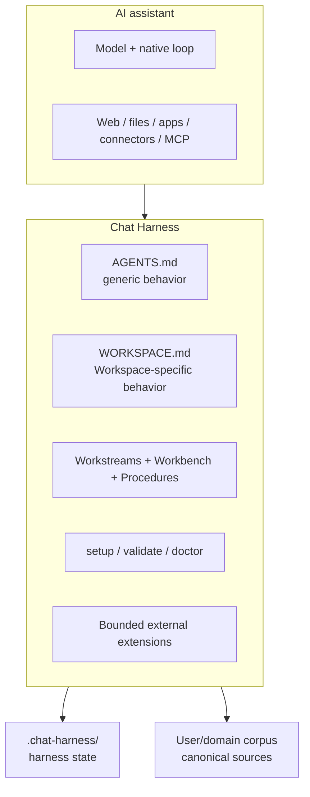

# Architecture

Chat Harness applies harness engineering around an existing AI assistant. The assistant owns the model, native conversation/tool loop, UI, and built-in capabilities. Chat Harness owns the project-level conventions and deterministic tooling that make long-running work easier to resume, verify, and maintain.

## Boundary



Chat Harness is not an agent runtime, orchestration platform, or memory database. It shapes execution around the host rather than reimplementing it.

## Workspace

A Workspace is an ownership and durable-state boundary:

```text
<Project>/
├── AGENTS.md
├── _inbox/
└── .chat-harness/
    ├── WORKSPACE.md
    ├── README.md
    ├── source-policy.yaml
    ├── workstreams/
    ├── workbench/
    │   ├── 0-ideas/
    │   ├── 1-research/
    │   ├── 2-analysis/
    │   ├── 3-plans/
    │   └── 4-reviews/
    ├── procedures/
    └── temp/
```

The user/domain owns the rest of the corpus. Chat Harness does not impose a universal domain taxonomy or reorganize existing content.

A Workspace is also not an information silo. Relevant authorized context may live in repositories, connected apps, other Workspaces, assistant context systems, or current public sources. Canon stays with its owning source.

## Portable instructions and Workspace instructions

`AGENTS.md` is the canonical portable source of generic Chat Harness behavior. A deterministic managed marker allows setup to recognize and refresh a Chat Harness-owned copy. Unknown `AGENTS.md` content is treated as a brownfield collision rather than silently adopted.

`.chat-harness/WORKSPACE.md` is the single Workspace-specific instruction extension: role, domain judgement, evidence/currentness standards, invariants, output expectations, boundaries, and domain-specific approvals.

[Specialists](specialists.md) seed `WORKSPACE.md` during setup. After creation, it is user-owned. There is no specialist inheritance, runtime composition, or template synchronization.

A host that cannot consume `AGENTS.md` directly uses a narrow host binding. The binding makes the canonical instructions effective without becoming a second instruction canon. ChatGPT Project Instructions are the reference binding; see [ChatGPT host setup](hosts/chatgpt.md).

## Operating protocol

For substantial work:

1. apply `AGENTS.md` and load `WORKSPACE.md` plus the Workspace Map;
2. determine whether the request continues an existing objective;
3. inspect relevant active or parked Workstreams before reconstructing state from chat history or model memory;
4. resume matching state from its Next action, or create a qualifying Workstream;
5. retrieve the minimum relevant Procedures and authoritative context, broadening when material;
6. reverify volatile facts;
7. use the simplest sufficient authorized capability;
8. verify results and evidence;
9. checkpoint material changes and reconcile durable state before substantial handoff.

A Workstream is a context entry point, not an information boundary.

## Source ownership

`.chat-harness/README.md` is the human-readable **Workspace Map**. It records routing and ownership, not machine configuration.

A Workstream is the durable resume point for one continuing objective. Domain facts remain authoritative in the record that owns them. Search indexes, assistant memory, summaries, and derived reports do not become canon merely because they are convenient.

Before creating durable canon, perform a targeted **CREATE** ownership check. Before substantial handoff, **CLOSE** by preserving materially valuable outputs and making the active Workstream resumable.

When shared durable state may have changed, refresh and reconcile before overwriting it.

## Workstreams, Workbench, Inbox, and temp

A Workstream is justified when there is an independent objective, an independent next action, and likely future continuation. It stores compact current state rather than conversation history.

Workbench holds substantial durable working artifacts under five organizational categories: ideas, research, analysis, plans, and reviews. The categories are not lifecycle phases; Workstreams and Workbench are parallel outputs from work.

`_inbox/` is visible user/automation → assistant intake and remains user-owned.

`.chat-harness/temp/` is assistant → assistant non-canonical transient storage. Valuable content should be promoted before closeout.

## Source Policy

`.chat-harness/source-policy.yaml` is narrow machine-readable privacy/source-handling policy. It is not a Workspace manifest or general configuration system.

Privacy profiles are `public`, `personal`, `confidential`, and `restricted`. The owning Workspace's policy governs its sources and cannot be silently weakened by a consuming Workspace.

For Chat Harness-controlled source reads, policy is resolved before protected content access. Host-native retrieval paths that Chat Harness cannot intercept are policy-aware rather than hard-enforced. See [Security](security.md).

## CLI architecture and brownfield safety

The CLI surface is intentionally small:

- `setup` — inspect, plan, reconcile, and verify the Workspace scaffold;
- `validate` — deterministic local integrity checks;
- `doctor` — read-only operational diagnosis.

Setup creates missing managed paths, can refresh a recognized Chat Harness-managed `AGENTS.md`, preserves user-owned Workspace/domain content by default, and surfaces unknown same-name collisions. Optional domain scaffolding is additive only.

It does not rename, move, merge, fuzzy-match, or semantically reorganize an existing domain corpus.

## Capability model

`Capability` is broad: native assistant tools, apps/connectors, MCP, and Chat Harness-managed extensions can all be capabilities.

`CapabilityProvider` is deliberately narrower: it describes only a Chat Harness-managed external extension boundary. Chat Harness does not invent a common executable interface over host-native tools for symmetry.

Escalation is:

```text
native assistant capability
  -> app / connector
  -> MCP or comparable host extension
  -> Chat Harness-managed bounded capability
  -> specialist worker when genuinely needed
```

A durable external capability has a stable identity, strict typed request, authority/security profile, handler-owned network policy, execution budgets, structured failure/result semantics, and lifecycle evidence.

The GitHub extension is one implementation of this boundary, not the center of the architecture.

## Authority and transparency

Autonomous read execution requires a capability to be safe, already authorized, and read-only. Consequential actions require explicit human approval at the action boundary unless already explicitly authorized.

Portable instructions also require **Action Transparency** before meaningful external mutations and proportional notice before non-obvious private/sensitive cross-context reads. Routine mechanics are not narrated.

## Evaluation and compatibility

Compatibility is capability- and evidence-based, not inferred from vendor similarity. The repository records `documented`, `verified`, and `unverified` host paths in [compatibility.md](compatibility.md).

[Examples](../examples/) show how the architecture feels in realistic Workspaces; [evals](../evals/README.md) encode falsifiable required and forbidden behavior.

## Non-goals

Chat Harness deliberately has no replacement agent loop, model-provider abstraction, workflow engine, scheduler, database, universal domain taxonomy, runtime specialist hierarchy, semantic migration framework, remote storage manager, full-screen TUI, or generic arbitrary shell/HTTP/browser capability.

These abstractions should be earned by real implementation pressure.
