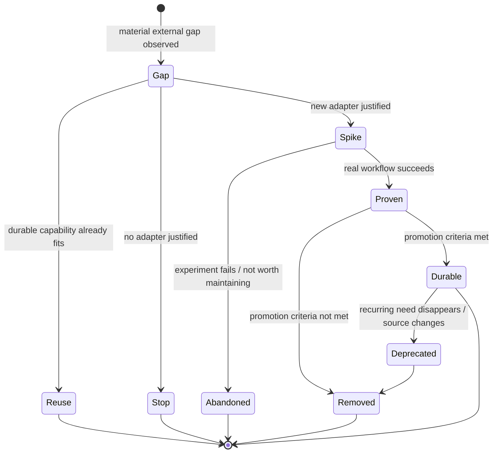
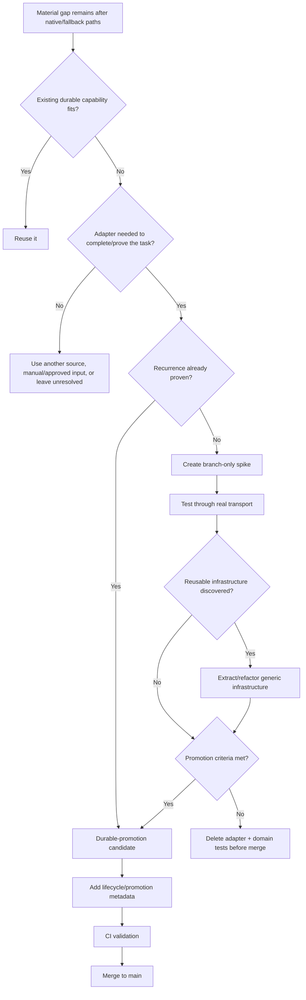
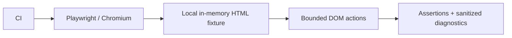

# Capability Adapter Lifecycle

## Summary

Capability adapters are **disposable by default**.

A task-specific adapter may be created on a branch to complete or prove a real workflow. It reaches `main` only if it satisfies explicit durable-promotion criteria. Otherwise the adapter and its domain-specific tests are deleted before merge; reusable runtime/infrastructure improvements may still be retained.

The active registry on `main` is therefore a **production allowlist**, not a history of experiments.

## State model



`Spike` is a branch state, not a valid production-registry lifecycle value.

## Decision procedure



## Lifecycle states

### Spike

Use `Spike` when:

- the need has been observed once;
- the adapter mainly completes or tests one task;
- reuse is plausible but unproven;
- the adapter is validating generic infrastructure.

Rules:

- branch-only;
- may temporarily modify the branch registry for end-to-end testing;
- may live under the normal capability path while the branch exists;
- must not remain in the active registry on `main`;
- must be deleted before merge unless explicitly promoted;
- domain-specific smoke tests must be removed or replaced by generic infrastructure tests before merge.

A spike PR may intentionally fail the lifecycle validator until promotion or cleanup is complete.

### Durable

A durable adapter is expected to remain callable from future ChatGPT sessions/projects.

Promotion is allowed through one of two bases.

| Promotion basis | Minimum evidence |
|---|---|
| **Recurring use** | At least two independent real tasks/sessions needed the same bounded capability contract. |
| **Recurring workflow** | A durable Project/workflow explicitly expects the operation repeatedly, and the capability has succeeded end-to-end at least once. |

Either route also requires:

- stable typed contract;
- explicit side-effect class;
- bounded destination/network policy;
- tests;
- successful real transport execution;
- acceptable maintenance and operational cost;
- no simpler native/API/HTTP alternative that makes the adapter unnecessary.

### Deprecated / removed

A durable capability should be deprecated or removed when:

- the recurring workflow disappears;
- the source/API no longer exists;
- native ChatGPT capability replaces it reliably;
- maintenance cost exceeds workflow value;
- security/privacy constraints no longer fit the transport.

The registry should represent current callable capability, not historical nostalgia.

## Registry contract

Every capability in `registry.json` on `main` must declare:

```json
{
  "lifecycle": "durable",
  "promotion": {
    "basis": "recurring-use | recurring-workflow",
    "evidence": ["..."],
    "reviewed_at": "YYYY-MM-DD"
  }
}
```

There is intentionally no valid `spike` value for the production registry.

## Repository hygiene invariants

On `main`:

- every `capabilities/**/handler.mjs` is referenced by the registry;
- every registry entry points to an existing handler;
- every registry entry is `lifecycle: durable`;
- `spikes/` and `experiments/` trees are forbidden;
- removed spike adapters do not leave domain-specific smoke tests behind.

Historical spike evidence belongs in:

- Git history and closed PRs;
- concise architectural rationale in `docs/design.md`;
- external Workbench/Research state when it matters outside the repo.

Do not keep dead adapter code merely as an example.

## Generic runtime testing

Reusable runtimes should be tested without keeping the domain adapter that originally proved them.

For the browser runtime, CI launches Chromium against an in-memory local HTML fixture.



This verifies Playwright installation, Chromium launch, bounded step execution, DOM interaction/extraction and diagnostics without retaining insurer-, retailer- or job-site-specific code.

## CI enforcement

`scripts/validate-registry.mjs` fails when:

- a registry entry is not durable;
- promotion metadata is missing or invalid;
- recurring-use promotion has fewer than two evidence references;
- a registered handler is missing;
- an orphan handler exists under `capabilities/`;
- `spikes/` or `experiments/` exists on the branch.

This turns cleanup into a merge prerequisite rather than a convention.

For strongest enforcement, configure GitHub branch protection/rulesets so the CI `test` check is required on `main`. The repository can validate lifecycle deterministically, but repository administration controls whether a privileged user can merge despite a failed check.

## Examples

### Durable: LinkedIn exact job lookup

`linkedin.job.lookup` is durable because exact LinkedIn job retrieval is part of a recurring Work & Career workflow and has been proven end-to-end.

### Removed spike: QCH private-health adapters

The QCH quote and hospital adapters were created to prove:

- browser-backed capability execution;
- progressive fallback from browser to direct HTTP;
- structured evidence through the real Issue → Actions → ChatGPT path.

They did not establish recurring capability demand, so the adapters were removed from `main`.

The reusable browser runtime, dispatcher/runtime changes, tests and design lessons remain.

## Operating rule

> **First occurrence creates a spike, not a product feature. Repetition or an explicit recurring workflow earns permanence.**
