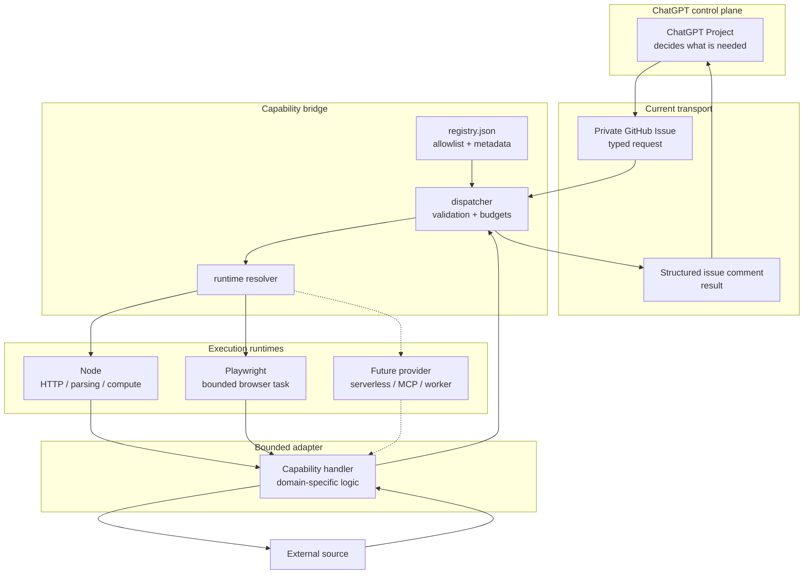
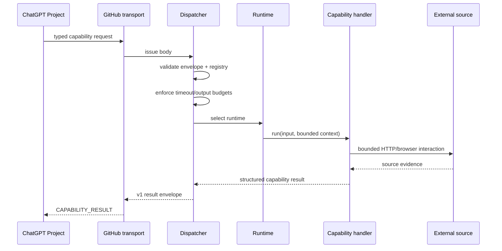
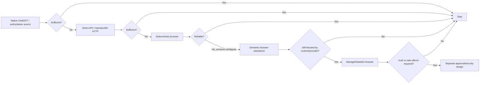

# Capability Bridge Design

## Summary

The capability bridge gives ordinary ChatGPT Project chats a **small, typed external execution plane** for operations that native ChatGPT tools cannot perform reliably.

ChatGPT remains the orchestrator. The bridge validates a named capability, selects a bounded runtime, executes one narrow adapter, and returns a structured result with explicit state and provenance.

The central design constraint is:

> **Generic infrastructure, specific capabilities.**

The bridge should survive the deletion of any one domain adapter.

Cross-project policy for **when** a capability should exist is canonical in:

`Tech & AI/20 - Knowledge/Guides/chatgpt-capability-extension.md`

This document owns the repository implementation design.

## Goals and non-goals

### Goals

The bridge should:

- expose stable typed capability contracts;
- keep domain Projects independent of transport/runtime plumbing;
- enforce side-effect, network, runtime and output boundaries;
- prefer the simplest reliable execution primitive;
- return evidence and explicit failure states that ChatGPT can reason over;
- keep runtimes and transport replaceable;
- remain small enough for one engineer to understand and operate.

### Non-goals

The bridge is not:

- a generic browser agent;
- arbitrary remote code execution;
- unrestricted HTTP;
- a workflow engine for whole research processes;
- a replacement for native ChatGPT search/plugins;
- a store for credentials or sensitive user data;
- a CAPTCHA/authentication bypass mechanism;
- a platform that forces every capability through the same runtime.

## System architecture



The bridge is generic. The handler owns domain-specific input validation, destination details, extraction and verification.

## Stable contract vs replaceable plumbing

### Stable contract

The architectural asset is:

```text
invoke(capability_name, typed_input) -> structured result
```

A durable capability defines:

- stable name;
- typed input;
- side-effect class;
- network/permission policy;
- timeout and output budgets;
- structured result and failure states;
- provenance/identity evidence;
- tests;
- lifecycle/promotion metadata.

### Replaceable plumbing

The following may change without changing the Project-side contract:

- GitHub Issue transport;
- GitHub Actions execution;
- Node runtime;
- Playwright;
- serverless/container execution;
- managed browser providers;
- future MCP endpoint;
- semantic or model-backed workers.

If latency, geography, statefulness, IP reputation, concurrency or cost becomes material, change the execution provider while preserving the capability contract where practical.

## Request execution



The dispatcher contains no domain logic.

## Execution selection

Use the least complex reliable path.



A browser-discovered workflow should be reduced to direct HTTP/API if a stable bounded request exists.

## Components

| Component | Responsibility | Must not own |
|---|---|---|
| `registry.json` | Capability allowlist, runtime, budgets, network/input metadata, lifecycle | Domain workflow execution |
| `src/dispatch.mjs` | Envelope validation, registry lookup, budget enforcement, handler invocation, result normalization | Domain-specific parsing/selectors |
| `src/resolve-runtime.mjs` | Tell CI/Actions which runtime dependencies are required | Capability policy decisions |
| `src/browser-runtime.mjs` | Shared Playwright launch/cleanup, allowlisting, budgets, aborts, sanitized diagnostics | Website-specific navigation |
| Capability handler | Domain validation, request/browser steps, extraction, verification, domain states | Generic orchestration |
| GitHub workflow | Transport/execution wiring and least-privilege permissions | Business logic |

## Runtime model

### Node

Use for:

- direct HTTP/API access;
- parsing;
- deterministic computation;
- short-lived probes.

Current durable example: `linkedin.job.lookup`.

### Browser

Use only when rendered or interactive state is genuinely required.

The shared runtime provides:

- headless Chromium lifecycle;
- locale/timezone configuration;
- default action/navigation timeouts;
- bounded action count;
- HTTPS top-level host allowlisting;
- abort handling;
- service-worker blocking;
- sanitized diagnostics.

Domain selectors and workflow logic stay in the adapter.

The browser runtime is durable infrastructure even though the private-health adapter that first proved it was removed.

## Capability lifecycle

Adapters are **disposable by default**.

The production registry on `main` contains only durable capabilities that have explicit promotion evidence. A one-off adapter can exist on a branch for end-to-end proof but must be deleted before merge unless it qualifies for durable promotion.

See [`capability-lifecycle.md`](capability-lifecycle.md) for the state model and CI enforcement.

## Safety and privacy

### Default posture

- read-only capabilities are the normal case;
- consequential writes require a capability-specific approval design;
- caller-controlled arbitrary hosts, headers, cookies, credentials and scripts are forbidden;
- capability destinations are handler-owned;
- browser top-level navigation is HTTPS + allowlist constrained.

### Sensitive data

The current GitHub Issue transport persists request bodies and comments.

Do not put credentials, auth cookies/tokens, payment data, sensitive health data, private identifiers or unnecessary PII into requests/results.

If private state is eventually required, use a dedicated secret/private-state boundary rather than embedding it in the Issue payload.

## Failure model

Failures are part of the public contract.

Representative states include:

| Class | Examples | Meaning |
|---|---|---|
| Request | `INVALID_INPUT`, `UNKNOWN_CAPABILITY` | Caller or routing problem |
| Execution | `TIMEOUT`, `FETCH_FAILED`, `OUTPUT_TOO_LARGE` | Runtime/source execution problem |
| Source | `NOT_FOUND`, `PARTIAL_EVIDENCE` | Source did not yield complete evidence |
| Browser | `UI_CHANGED`, `BOT_BLOCKED` | Interactive workflow no longer matches assumptions |
| Boundary | `AUTH_REQUIRED` | Public/read-only capability has reached a security boundary |

Do not collapse these into generic exceptions; ChatGPT needs to know whether to retry, use another source, stop, or request approved/manual action.

## Observability and operability

Every non-trivial capability should return enough **sanitized** metadata to diagnose reliability without dumping source pages:

- retrieval timestamp;
- execution mode;
- source/final URL where safe;
- duration;
- meaningful browser step count where applicable;
- explicit result state.

Operational signals that justify changing runtime/provider include recurring:

- timeouts;
- 403/429 or IP reputation failures;
- geography mismatch;
- browser startup cost;
- selector maintenance;
- concurrency pressure;
- state/auth requirements.

Do not pre-build around hypothetical scale.

## Validation evidence

The initial browser spike used private-health research because it exercised several failure shapes.

| Experiment | Observation | Durable architectural lesson |
|---|---|---|
| QCH personalised quote | Multi-step interaction genuinely required Playwright | Browser runtime class is useful |
| QCH hospital lookup | Browser inspection exposed a stable GET contract | Downgrade to HTTP when possible |
| Medibank provider finder | Public page exposed no actionable provider-search UI | Some gaps are source/auth boundaries, not browser problems |

The domain adapters were removed after the spike. The reusable runtime, budgets, failure handling and lifecycle rules remain.

The first browser-runtime rollout also reconciled two divergent implementation spikes: stronger reusable runtime/packaging pieces were consolidated into the empirically tested path before merge. That history belongs here only as rationale; PRs remain the detailed implementation record.

## Current state

- `main` exposes the durable `linkedin.job.lookup` capability.
- Node and browser runtime classes are supported.
- No durable browser-backed adapter is currently registered.
- Browser infrastructure is tested through a domain-agnostic local fixture.
- CI validates that only durable promoted adapters can remain in the production registry.

## Future evolution

Possible future execution providers include serverless functions, persistent workers, managed browsers, MCP endpoints, external LLM workers and bounded semantic-decision models such as Jev.

They should preserve the same principles:

> **ChatGPT orchestrates. Capabilities are typed and bounded. Runtimes are replaceable. Adapters earn permanence.**
